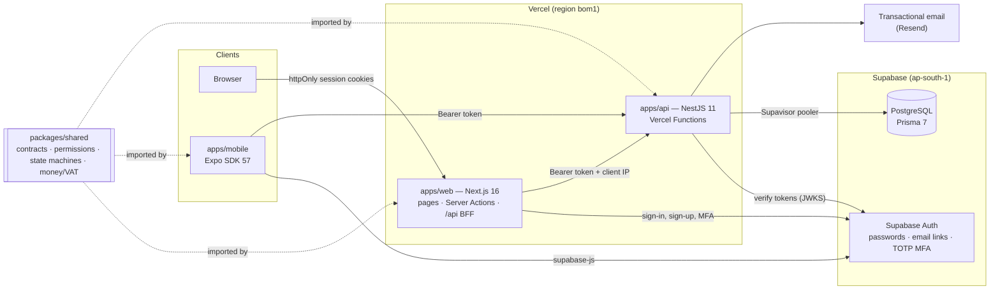

# TopFlow Hub — B2B/B2C commerce platform for Top Flow

> **Top Flow — Irrigation & Flow Control Supplies, UAE** supplies electrofusion and HDPE fittings, sprinklers and rotors, drip irrigation, pipes and fittings, valves, filtration and landscaping products to two very different audiences:

- **Consumers** who want to buy a few rotors for a villa garden online, at VAT-inclusive prices, paying on delivery.
- **Businesses** — landscapers, MEP contractors, facility managers, developers — who buy for projects through **quotations**, negotiated prices, **purchase approvals** and **credit terms**.

**TopFlow Hub** serves both: a storefront with approximate prices and quote requests, a trade portal, a back office for Top Flow's teams and a mobile app. This monorepo contains all of them and the shared domain contracts that keep them consistent.

| Environment | Web app | API |
| --- | --- | --- |
| Local | http://localhost:3002 | http://localhost:3000 (`/docs`) |

> Nothing is hosted yet: no free plan both allows a commercial site and fits this application, so the platform runs locally while Top Flow decides where to publish it ([ADR-019](docs/DECISIONS.md)).

---

## Highlights

| Capability | What it does |
| --- | --- |
| **Catalogue** | Top Flow's range of 323 products in 9 categories and 41 product lines, with photos and specifications. Each product shows an approximate price range (**≈ AED min – max**, VAT included), and search covers names, codes and tags. See [packages/database/prisma/data](packages/database/prisma/data/README.md). |
| **Quote requests** | Anyone can send their basket for a quotation — or describe a project without choosing products — with a preferred contact channel and a required-by date. Requests land in the sales inbox next to trade RFQs, and the visitor gets an acknowledgement. |
| **Retail (B2C)** | VAT-inclusive prices, a guest basket, server-priced checkout (cash or card on delivery), and order tracking with a full status timeline. |
| **Procurement (B2B)** | Organizations with Owner / Approver / Buyer roles, RFQs, **versioned quotations** with **PDF** generation, accept / reject / request-revision, **spending-limit approvals** (segregation of duties), and sales orders released on the organization's **credit terms**. |
| **Multi-tenancy** | Every B2B request runs inside a verified organization context (`x-organization-id`). Users can belong to several organizations, and Top Flow staff verify each company (KYC). |
| **Operations** | Role-based back office for Sales, Warehouse and Admin: KYC queue, quotation builder, fulfilment state machine, stock deduction at dispatch, low-stock alerts, dashboard KPIs, staff invitations and an immutable audit trail. |
| **Identity & security** | **Supabase Auth** with email confirmation, password recovery and **two-factor authentication required for staff**. Web sessions live in httpOnly cookies behind a backend-for-frontend; the API verifies Supabase tokens (JWKS) and enforces RBAC and tenant isolation. Platform tables are locked away from Supabase's public Data API, rate limits apply per client, and prices are never trusted from clients. |
| **Engineering** | Turborepo monorepo, shared **Zod contracts + workflow state machines + integer money/VAT maths** used by API, web and mobile, compile-time enum parity with Prisma, data-preserving migrations, unit and end-to-end tests, CI, and nightly **encrypted off-site database backups**. |

## Architecture



Read more in [docs/ARCHITECTURE.md](docs/ARCHITECTURE.md) (data model, workflows, authentication, tenancy), the [design decisions](docs/DECISIONS.md) and the [operations runbook](docs/OPERATIONS.md).

## Repository layout

```
apps/
  api/        NestJS REST API (Swagger at /docs outside production), deployed as a Vercel Function
  web/        Next.js storefront, trade portal (/business) and back office (/admin), deployed to Vercel
  mobile/     Expo React Native app
packages/
  shared/     @topflow/shared — enums, permissions, workflows, money/VAT, Zod schemas, DTO types
  database/   @topflow/database — Prisma schema, migrations, seed, generated client
supabase/     Supabase configuration: auth policy, branded email templates, storage buckets
docs/         Architecture, decisions, operations runbook, academic evolution
```

## Tech stack

| Layer | Technology |
| --- | --- |
| Language | TypeScript everywhere (strict) |
| API | NestJS 11, Zod (`nestjs-zod`), Swagger/OpenAPI, `jose`, `@nestjs/throttler`, Helmet, PDFKit |
| Identity | Supabase Auth (`@supabase/ssr` on the web, `@supabase/supabase-js` on mobile and for administration) |
| Data | Supabase PostgreSQL, Prisma 7 with the `pg` driver adapter |
| Web | Next.js 16 (App Router, Turbopack), React 19, Tailwind CSS 4, Lucide icons |
| Mobile | Expo SDK 57, Expo Router, SecureStore |
| Hosting | Vercel (web and API on Fluid compute), Supabase |
| Tooling | npm workspaces, Turborepo, ESLint, Prettier, Jest, Supertest, GitHub Actions |

## Getting started

**Prerequisites:** Node.js 22+ (24 recommended), npm 11 and Docker Desktop (for the local Supabase stack).

```bash
npm install

# 1. Start Supabase locally: PostgreSQL, Auth, Storage, Studio and a mail catcher
npm run supabase:start
npx supabase status             # URLs and keys for the next step

# 2. Configure the apps (see the comments in each example file)
cp apps/api/.env.example apps/api/.env
cp apps/web/.env.example apps/web/.env.local
#    packages/database/.env needs DATABASE_URL, SUPABASE_URL and SUPABASE_SECRET_KEY

# 3. Create the schema and load demo data (this also creates the demo sign-ins)
npm run db:deploy
npm run db:seed

# 4. Run everything (API :3000, web :3002)
npm run dev
```

| Local service | URL |
| --- | --- |
| Web app | http://localhost:3002 |
| API docs | http://localhost:3000/docs |
| Supabase Studio | http://127.0.0.1:54323 |
| Emails sent by the stack | http://127.0.0.1:54324 |

### Demo accounts

Locally, every seeded account uses the password `TopFlow2026!`. Because that password is public, a shared or production environment must be seeded with its own `SEED_DEMO_PASSWORD` (see `.env.example`). With `STAFF_MFA_REQUIRED=true`, staff accounts are asked to set up an authenticator app the first time they open the back office.

| Email | Role | Try |
| --- | --- | --- |
| `customer@example.com` | Retail customer | Checkout, order tracking |
| `buyer@desertbloom.ae` | Trade **buyer** (AED 5,000 limit) | RFQs, accepting quotations |
| `approver@desertbloom.ae` | Trade **approver** (AED 50,000 limit) | Approving purchases above the buyer's limit |
| `owner@desertbloom.ae` | Trade **owner** | Team invitations, delivery sites, company profile |
| `sales@topflow.ae` | Top Flow sales | KYC, RFQ triage, quotation builder |
| `warehouse@topflow.ae` | Top Flow warehouse | Fulfilment, stock |
| `admin@topflow.ae` | Administrator | Everything, including staff invitations and the audit trail |

## Quality

```bash
npm run check-types                     # all workspaces
npm run lint
npm test                                # unit tests (shared contracts + API)
npm run test:e2e -w @topflow/api        # end-to-end suite against a real database
```

- **Unit tests** cover money/VAT maths, workflow state machines, the permission matrix, request schemas, Supabase token verification, guards, error mapping and configuration.
- **End-to-end tests** boot the real application (the production middleware stack) against PostgreSQL. They simulate Supabase Auth with locally signed tokens and exercise account provisioning, token rejection, staff MFA, staff invitations and suspension, team invitations, RBAC, tenant isolation, the full RFQ → quotation → approval → order flow, website quote requests and retail fulfilment. A test also asserts that every table has Row Level Security enabled.
- **CI** (`.github/workflows/ci.yml`) runs lint, type checks, unit tests and builds for every workspace, plus the end-to-end suite against a PostgreSQL service container.

## Deployment

The platform is deployment-ready but not hosted. Vercel's free plan allows non-commercial use only, and no other free plan both permits a business site and fits a server-rendered app with its own API, so the choice is deferred ([ADR-019](docs/DECISIONS.md)); Netlify's free plan is the default when Top Flow decides to publish.

| Piece | Intended home |
| --- | --- |
| Web and API | one host with serverless functions — Netlify's free plan, or Vercel Pro / Google Cloud Run where a card and a small bill are acceptable |
| Database, authentication and storage | Supabase, whose free plan places no restriction on business use |
| Backups | GitHub Actions: a nightly `supabase db dump`, encrypted with age and kept for 30 days |

Nothing in the code depends on a particular host: the environment is validated at boot, and `npm run release` applies migrations before a new version serves traffic.

Configuration, releases, backups, restores and secret rotation are described in [docs/OPERATIONS.md](docs/OPERATIONS.md).

## From academic prototype to production

The original coursework was a Kotlin/Firebase Android app for a bicycle shop. [docs/ACADEMIC-EVOLUTION.md](docs/ACADEMIC-EVOLUTION.md) maps each prototype feature — and each of its engineering shortcuts, such as a hard-coded `admin/admin` login, card numbers typed into the app and totals computed on the device — to the production design used here.
