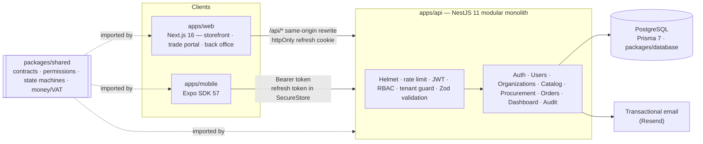

# Top Flow — B2B/B2C Commerce Platform

> From an academic prototype (the UWL *Bicycle Shop* Android app) to a production-grade commerce platform for **Top Flow — Irrigation & Flow Control Supplies, UAE** ([www.topflow.ae](https://www.topflow.ae/)).

Top Flow sells sprinklers, drip irrigation, valves, controllers, pipes and pumps to two very different audiences:

- **Consumers** who want to buy a few rotors for a villa garden online, at VAT-inclusive prices, paying on delivery.
- **Businesses** — landscapers, MEP contractors, facility managers, developers — who buy for projects through **quotations**, negotiated prices, **purchase approvals** and **credit terms**.

This monorepo contains the API, the web storefront / trade portal / back office, the mobile app and the shared domain contracts that tie them together.

---

## Highlights

| Capability | What it does |
| --- | --- |
| **Retail (B2C)** | Searchable catalog with VAT-inclusive prices, guest cart, server-priced checkout (cash/card on delivery), order tracking with a full status timeline. |
| **Procurement (B2B)** | Organizations with Owner / Approver / Buyer roles, RFQs from the cart, **versioned quotations** with automated **PDF** generation, accept / reject / request-revision, **spending-limit approvals** (segregation of duties), sales orders released on the organization's **credit terms**. |
| **Multi-tenancy** | Every B2B request runs inside a verified organization context (`x-organization-id`); users can belong to several organizations; KYC verification by Top Flow staff. |
| **Operations** | Role-based back office for Sales, Warehouse and Admin: KYC queue, quotation builder, fulfilment state machine, stock deduction at dispatch, low-stock alerts, dashboard KPIs, immutable audit trail. |
| **Security** | Short-lived JWT access tokens + rotating refresh tokens with **reuse detection**, httpOnly cookies for browsers, server-side RBAC and tenant guards, rate limiting, Helmet, validated environment, prices never trusted from clients. |
| **Engineering** | Turborepo monorepo, shared **Zod contracts + workflow state machines + integer money/VAT maths** used by API, web and mobile, compile-time enum parity with Prisma, data-preserving migrations, unit + end-to-end tests, CI, `turbo prune` Docker image. |

## Architecture



Read more in [docs/ARCHITECTURE.md](docs/ARCHITECTURE.md) (data model, workflows, auth sequence, tenancy) and the [design decisions](docs/DECISIONS.md).

## Repository layout

```
apps/
  api/        NestJS REST API (Swagger at /docs)
  web/        Next.js storefront, trade portal (/business) and back office (/admin)
  mobile/     Expo React Native app
packages/
  shared/     @topflow/shared — enums, permissions, workflows, money/VAT, Zod schemas, DTO types
  database/   @topflow/database — Prisma schema, migrations, seed, generated client
docs/         Architecture, decisions, academic evolution
```

## Tech stack

| Layer | Technology |
| --- | --- |
| Language | TypeScript everywhere (strict) |
| API | NestJS 11, Zod (`nestjs-zod`), Swagger/OpenAPI, `@nestjs/throttler`, Helmet, PDFKit |
| Data | PostgreSQL, Prisma 7 with the `pg` driver adapter |
| Web | Next.js 16 (App Router, Turbopack), React 19, Tailwind CSS 4 |
| Mobile | Expo SDK 57, Expo Router, SecureStore |
| Tooling | npm workspaces, Turborepo, ESLint, Prettier, Jest, Supertest, GitHub Actions, Docker |

## Getting started

**Prerequisites:** Node.js 22+ (24 recommended) and npm 11. No Docker required.

```bash
npm install

# 1. Start a local PostgreSQL (Prisma Postgres dev server) and note the TCP URL it prints
npm run db:up

# 2. Configure the API (then paste the database URL into apps/api/.env)
cp apps/api/.env.example apps/api/.env

# 3. Create the schema and load demo data
DATABASE_URL="postgres://…" npm run db:deploy
DATABASE_URL="postgres://…" npm run db:seed

# 4. Run everything (API :3000, web :3002)
npm run dev
```

- API docs: <http://localhost:3000/docs>
- Web: <http://localhost:3002> (set `API_INTERNAL_URL=http://localhost:3000` and `NEXT_PUBLIC_DEMO_MODE=true` in `apps/web/.env.local`)
- Prefer containers? `JWT_SECRET=$(openssl rand -base64 48) docker compose up --build` starts PostgreSQL and the API.

### Demo accounts

All seeded accounts use the password `TopFlow2026!`.

| Email | Role | Try |
| --- | --- | --- |
| `customer@example.com` | Retail customer | Checkout, order tracking |
| `buyer@desertbloom.ae` | Trade **buyer** (AED 5,000 limit) | RFQs, accepting quotations |
| `approver@desertbloom.ae` | Trade **approver** (AED 50,000 limit) | Approving purchases above the buyer's limit |
| `owner@desertbloom.ae` | Trade **owner** | Team invitations, delivery sites, company profile |
| `sales@topflow.ae` | Top Flow sales | KYC, RFQ triage, quotation builder |
| `warehouse@topflow.ae` | Top Flow warehouse | Fulfilment, stock |
| `admin@topflow.ae` | Administrator | Everything, users, audit trail |

## Quality

```bash
npm run check-types                     # all workspaces
npm run lint
npm test                                # unit tests (shared contracts + API)
npm run test:e2e -w @topflow/api        # end-to-end suite against a real database
```

- **Unit tests** cover money/VAT maths, workflow state machines, the permission matrix, request schemas, token rotation & reuse detection, guards, error mapping and configuration.
- **End-to-end tests** boot the real application (same middleware as production) against PostgreSQL and exercise authentication, RBAC, tenant isolation, the full RFQ → quotation → approval → order flow and retail fulfilment.
- **CI** (`.github/workflows/ci.yml`) runs lint, type checks, unit tests and builds for every workspace, the end-to-end suite against a PostgreSQL service container, and a Docker image build.

## Deployment

| Component | Target | Notes |
| --- | --- | --- |
| API | Railway (root `Dockerfile`) | Multi-stage `turbo prune` image, non-root user, health check, runs `prisma migrate deploy` on start. Set `DATABASE_URL`, `JWT_SECRET` (≥ 32 chars), `APP_PUBLIC_URL`, `CORS_ORIGINS`, `TRUST_PROXY=true`, mail settings. |
| Web | Vercel (`apps/web`) | Set `API_INTERNAL_URL` to the API origin — the browser reaches the API through the `/api` rewrite, so cookies stay first-party. |
| Database | Managed PostgreSQL | Migration `20260914090000_platform_v2` converts v1 data (contractors → organizations, enquiries → RFQs). Test it on a copy of production first. |

See `apps/api/.env.example` for every configuration option.

## From academic prototype to production

The original coursework was a Kotlin/Firebase Android app for a bicycle shop. [docs/ACADEMIC-EVOLUTION.md](docs/ACADEMIC-EVOLUTION.md) maps each prototype feature — and each of its engineering shortcuts, such as a hard-coded `admin/admin` login, card numbers typed into the app and totals computed on the device — to the production design used here.
