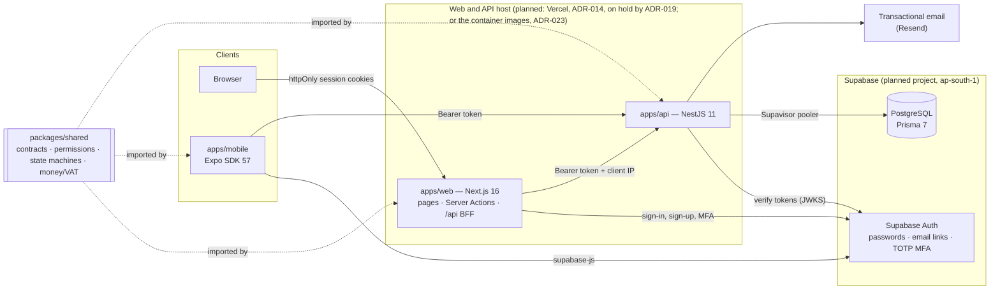

# TopFlow Hub — a portfolio B2B/B2C commerce platform, built with Top Flow's permission

A monorepo with a storefront, a trade portal, a back office, an API and a mobile app for a UAE irrigation supplier, covering quotations, purchase approvals and credit terms as well as retail orders. It is packaged as container images with a production-like stack, Terraform for AWS (never applied) and a release pipeline tested against a fake AWS CLI, and one setting turns a build into a public portfolio demo.

[](https://github.com/fasharif/topflow/actions/workflows/ci.yml)
[](https://github.com/fasharif/topflow/actions/workflows/containers.yml)

> **Portfolio project.** Built independently by Farah Sharif, with Top Flow's permission to use its name and product catalogue. This is not Top Flow's official online store, and nothing is hosted yet. Every page of the web app says so: the portfolio notice in an ordinary build, the demo banner in a demo build.


*The storefront served by the production-like Compose stack (`docker-compose.prod.yml`, images built from commit `4725a2e`), captured with headless Chrome for Testing 153 at 1280 × 800 on 26 September 2026. It is a local stack, not a hosted site.*

## The problem

**Top Flow — Irrigation & Flow Control Supplies, UAE** sells electrofusion and HDPE fittings, sprinklers and rotors, drip irrigation, pipes and fittings, valves, filtration and landscaping products to two very different audiences:

- **Consumers** who want to buy a few rotors for a villa garden online, at VAT-inclusive prices, paying on delivery.
- **Businesses** — landscapers, MEP contractors, facility managers, developers — who buy for projects through **quotations**, negotiated prices, **purchase approvals** and **credit terms**.

A plain web shop serves the first group only. **TopFlow Hub** serves both: a storefront with approximate prices and quote requests, a trade portal, a back office for Top Flow's teams and a mobile app, all built on one set of shared domain contracts so prices, VAT and workflow rules agree everywhere. Because hosting is deferred until an officially free option fits (ADR-019), the platform also has to be ready to deploy anywhere without spending money on it now.

## Try the demo

> **Not hosted yet.** There is no public demo address today. Demo mode and the nightly reset are built and tested on a local machine, and the CI workflow runs the reset and the demo checks on every push to `develop` and feature branches and on every pull request to `develop`, but no demo deployment exists and the reset has never run against a hosted Supabase project. This section describes how the demo will work and how to run the same demo mode on your own machine.


*The sign-in page of a local demo build (`NEXT_PUBLIC_DEMO_MODE=true`), captured with headless Chromium on 26 September 2026. It is not a hosted site.*

The public demo will be the production build with demo mode switched on (`DEMO_MODE=true` in the API, `NEXT_PUBLIC_DEMO_MODE=true` in the web app), on a Supabase project of its own:

- Every page says *"Portfolio demo: data resets every night. This is not Top Flow's official store."* in place of the portfolio notice, every page title and link preview calls the site a portfolio demo, and search engines are asked not to index it, as for every build. The contact page and the footer say that Top Flow's phone number and email address are real, but that quote requests and orders made in the demo are not passed to Top Flow.
- You sign in with the published [demo accounts](#demo-accounts), from the retail customer to the administrator. They share the password `TopFlow2026!`, and the sign-in page lists them. Their addresses are on reserved example domains, so they are not real mailboxes.
- The demo emails nobody outside a short allow-list. Business emails (quote acknowledgements, quotations, order updates, team invitations) are withheld, and the web app says so; staff invitations and customer invitations from website requests are refused; sign-up and password reset emails are switched off.
- The demo accounts keep their role, membership and access, and the demo company (Desert Bloom Landscaping LLC) keeps its KYC status, trading terms and TRN, so no visitor can lock the others out of the trade flow. The web app does not offer password or two-factor changes for the shared accounts; changes made by calling Supabase Auth directly are undone by the nightly reset. Rate limits stay on.
- Every night at 03:00 UAE time, a GitHub Actions workflow runs `npm run demo:reset`, which empties the database, deletes every sign-in of the demo project (after checking that the project and the database belong together) and loads the demo data again.

**Demo mode on your machine.** After the development setup of the [quick start](#quick-start), set `DEMO_MODE=true` and `STAFF_MFA_REQUIRED=false` in `apps/api/.env` and `NEXT_PUBLIC_DEMO_MODE=true` in `apps/web/.env.local`, then run `npm run dev`. To return the local database to the demo data set, run `DEMO_MODE=true npm run demo:reset -- --confirm` in bash, or `$env:DEMO_MODE='true'; npm run demo:reset -- --confirm; Remove-Item Env:DEMO_MODE` in PowerShell. The reset takes `DEMO_MODE` only from the shell, never from an `.env` file, and also replaces the local sign-ins when `packages/database/.env` holds the local stack's keys.

Why it works this way: [ADR-021](docs/DECISIONS.md). How to host it and what it does not prevent: [the runbook's *Public demo* section](docs/OPERATIONS.md#public-demo).

## Features

| Capability | What it does |
| --- | --- |
| **Catalogue** | 346 products in 11 categories and 61 product lines: 241 from Top Flow's own catalogue and 105 typical products of the UAE irrigation market with estimated prices, all with photos or drawn illustrations and specifications. Each product shows an approximate price range (**≈ AED min – max**, VAT included), and search covers names, codes and tags. Counted from `packages/database/prisma/data/topflow-catalogue.json`; sources and licensing in [its README](packages/database/prisma/data/README.md). |
| **Quote requests** | Anyone can send their basket for a quotation — or describe a project without choosing products — with a preferred contact channel and a required-by date. Requests land in the sales inbox next to trade RFQs, and the visitor gets an acknowledgement. |
| **Retail (B2C)** | VAT-inclusive prices, a guest basket, server-priced checkout (cash or card on delivery), and order tracking with a full status timeline. |
| **Procurement (B2B)** | Organisations with Owner / Approver / Buyer roles, RFQs, **versioned quotations** with **PDF** generation, accept / reject / request-revision, **spending-limit approvals** (segregation of duties), and sales orders released on the organisation's **credit terms**. |
| **Multi-tenancy** | Every B2B request runs inside a verified organisation context (`x-organization-id`). Users can belong to several organisations, and Top Flow staff verify each company (KYC). |
| **Operations** | Role-based back office for Sales, Warehouse and Admin: KYC queue, quotation builder, fulfilment state machine, stock deduction at dispatch, low-stock alerts, dashboard KPIs, staff invitations and an immutable audit trail. |
| **Identity & security** | **Supabase Auth** with email confirmation, password recovery and **two-factor authentication required for staff**. Web sessions live in httpOnly cookies behind a backend-for-frontend; the API verifies Supabase tokens (JWKS) and enforces RBAC and tenant isolation. Platform tables are locked away from Supabase's public Data API, rate limits apply per client, and prices are never trusted from clients. |
| **Public demo mode** | One setting per app turns a production build into the portfolio demo described above: a mail guard with an allow-list, refused invitations, fixed demo accounts and demo company, a banner in place of the portfolio notice, demo page titles and link previews, and a guarded nightly reset. |
| **Containers** | Non-root images for the API, its release step (migrations) and the web app, scanned with Trivy (critical findings fail the build). A **production-like Compose stack** runs them with HTTPS, Supabase Auth and the release step before the API; the Containers workflow starts it for every change and signs in through Supabase Auth. On `develop`, it publishes exactly the images it tested, with signed provenance and SBOM attestations. |
| **AWS, prepared** | **Terraform** for staging and production on ECS Fargate behind a load balancer, with secrets in SSM, CloudWatch alarms, a budget alert, S3 state with locking and GitHub OIDC roles under a permissions boundary. Checked with `terraform test` against a mocked provider, tflint and Trivy; **never applied**. |
| **Releases** | A manual deploy that verifies each image's provenance, pins digests, runs migrations before new code, keeps both services on one release if a rollout fails, and **rolls back in one step**; a restart for rotated secrets; a smoke test and an uptime check. |
| **Operations tooling** | Optional **Sentry** for server errors (a no-op without `SENTRY_DSN`), a workflow for nightly **encrypted off-site database backups** (it skips until a database is hosted), and a **timed restore drill**, whose test restores a synthetic backup encrypted to a throwaway key. |

## Architecture


```mermaid
flowchart LR
  subgraph Clients
    BROWSER["Browser"]
    MOB["apps/mobile<br/>Expo SDK 57"]
  end
  subgraph Host["Web and API host (planned: Vercel, ADR-014, on hold by ADR-019;<br/>or the container images, ADR-023)"]
    WEB["apps/web — Next.js 16<br/>pages · Server Actions · /api BFF"]
    API["apps/api — NestJS 11"]
  end
  subgraph Supabase["Supabase (planned project, ap-south-1)"]
    AUTH["Supabase Auth<br/>passwords · email links · TOTP MFA"]
    DB[("PostgreSQL<br/>Prisma 7")]
  end
  SHARED[["packages/shared<br/>contracts · permissions · state machines · money/VAT"]]
  MAIL["Transactional email<br/>(Resend)"]

  BROWSER -- "httpOnly session cookies" --> WEB
  WEB -- "sign-in, sign-up, MFA" --> AUTH
  WEB -- "Bearer token + client IP" --> API
  MOB -- "supabase-js" --> AUTH
  MOB -- "Bearer token" --> API
  API -- "verify tokens (JWKS)" --> AUTH
  API -- "Supavisor pooler" --> DB
  API --> MAIL
  SHARED -. imported by .-> WEB
  SHARED -. imported by .-> MOB
  SHARED -. imported by .-> API
```

The browser never holds a token: the web app's server keeps the Supabase session in httpOnly cookies and forwards API calls with the access token (ADR-013). The API authorises every request itself, with roles, organisation permissions and tenant checks.

**Delivery.** Three images carry the code: `topflow-hub-api`, `topflow-hub-migrate` (the release step: environment check, then database migrations) and `topflow-hub-web`. The same images run in the Compose stack and in the AWS layout: ECS Fargate services behind an Application Load Balancer, the release step as a one-off task before either service changes, and Supabase unchanged for data and identity. Diagrams and details: [docs/ARCHITECTURE.md](docs/ARCHITECTURE.md) (data model, workflows, authentication, tenancy, containers) and [infra/README.md](infra/README.md) (images, stack, AWS, cost, releases).

## Tech stack

| Layer | Technology | Why |
| --- | --- | --- |
| Language | TypeScript everywhere (strict) | One language across API, web, mobile and the infrastructure scripts, so the shared contracts are checked by the compiler in every app. |
| API | NestJS 11, Zod (`nestjs-zod`), Swagger/OpenAPI, `jose`, `@nestjs/throttler`, Helmet, PDFKit | Modules, guards and dependency injection suit a modular monolith with RBAC and tenancy (ADR-001); Zod schemas are shared with the clients. |
| Identity | Supabase Auth (`@supabase/ssr` on the web, `@supabase/supabase-js` on mobile and for administration) | Email links, TOTP and session handling without running an identity service; the API keeps authorisation (ADR-012). |
| Data | Supabase PostgreSQL, Prisma 7 with the `pg` driver adapter | Transactions for money, stock and approvals; a typed client and reviewed SQL migrations (ADR-003). |
| Web | Next.js 16 (App Router, Turbopack), React 19, Tailwind CSS 4, Lucide icons | Server-rendered catalogue pages, and Server Actions that keep authentication on the server. |
| Mobile | Expo SDK 57, Expo Router, SecureStore | One React Native codebase for Android and iOS that reuses the shared package. |
| Containers | Docker multi-stage builds, traced runtimes, Docker Compose, Caddy, GoTrue, Trivy | Small non-root images that run on any container host; a stack that exercises the real release order, HTTPS and Supabase Auth on one machine (ADR-023). |
| Cloud (prepared) | Terraform 1.16 with the AWS provider, ECS Fargate, ALB, SSM, CloudWatch, tflint, `terraform test` | Fargate runs the release step as a one-off task, which App Runner cannot; everything is testable without an account (ADR-023). |
| Delivery | GitHub Actions with OIDC to AWS, artifact attestations (Sigstore), Dependabot, Sentry | No stored cloud keys; deploys verify that an image came from this repository's CI; errors reported only when configured. |
| Tooling | npm workspaces, Turborepo, ESLint, Prettier, Jest, Supertest, `node:test`, ShellCheck, actionlint, release-please | Builds in dependency order with caching; CI lints and tests every script and workflow; release-please versions the releases. |

## Quick start

**Prerequisites:** Docker (with Compose) and Node.js 22.18 or later. The production-like stack runs everything, including Supabase Auth, in containers:

```bash
git clone https://github.com/fasharif/topflow.git && cd topflow
node infra/compose/generate-env.mts     # secrets, Supabase keys and URLs → infra/compose/.env
docker compose -f docker-compose.prod.yml --env-file infra/compose/.env up -d --build --wait
docker compose -f docker-compose.prod.yml --env-file infra/compose/.env --profile demo run --rm --build seed
```

Then open https://localhost:8443 (a local certificate authority: accept the warning, or trust its root certificate as [infra/README.md](infra/README.md#production-like-stack-docker-compose) explains). The API is at https://api.localhost:8443, and the emails Supabase Auth sends appear at http://127.0.0.1:8025. `docker compose -f docker-compose.prod.yml --env-file infra/compose/.env --profile demo down -v` stops everything and deletes the data.

**For development** with hot reload, against the Supabase CLI stack (Node.js 22+, npm 11):

```bash
npm install
npm run supabase:start   # local PostgreSQL, Auth, Storage, Studio and a mail catcher
npm run setup            # env files from the examples, local keys, migrations and demo data
npm run dev              # API on :3000 (Swagger at /docs), web app on :3002
```

`npm run setup` copies the API, web and database `.env.example` files to the files those apps read (it never overwrites one; the mobile app's is left to you, see [Configuration](#configuration)), fills in the local Supabase keys from `npx supabase status -o env` and a shared `INTERNAL_API_SECRET` where they are empty, then runs `npm run db:deploy` and `npm run db:seed`. It only loads data into a database on this machine. If it reports a key as still empty, copy it from `npx supabase status`.

| Local service | URL |
| --- | --- |
| Web app | http://localhost:3002 |
| API docs | http://localhost:3000/docs |
| Supabase Studio | http://127.0.0.1:54323 |
| Emails sent by the stack | http://127.0.0.1:54324 |

### Demo accounts

Every seeded account uses the password `TopFlow2026!` unless `SEED_DEMO_PASSWORD` is set (see `.env.example`). Because that password is public, a shared or production environment must be seeded with its own. The public demo is the exception: its password is published on purpose, and its data resets every night ([Try the demo](#try-the-demo)). With `STAFF_MFA_REQUIRED=true` (always on in the Compose stack), staff accounts are asked to set up an authenticator app the first time they open the back office.

| Email | Role | Try |
| --- | --- | --- |
| `customer@example.com` | Retail customer | Checkout, order tracking |
| `buyer@desertbloom.example` | Trade **buyer** (AED 5,000 limit) | RFQs, accepting quotations |
| `approver@desertbloom.example` | Trade **approver** (AED 50,000 limit) | Approving purchases above the buyer's limit |
| `owner@desertbloom.example` | Trade **owner** | Team invitations, delivery sites, company profile |
| `sales@topflow.example` | Top Flow sales | KYC, RFQ triage, quotation builder |
| `warehouse@topflow.example` | Top Flow warehouse | Fulfilment, stock |
| `admin@topflow.example` | Administrator | Everything, including staff invitations and the audit trail |

The addresses use reserved example domains (RFC 2606). Desert Bloom Landscaping LLC is a fictional company.

## Configuration

Each app reads its own environment file, and every variable is described in the example next to it. Nothing secret is committed: only `.env.example` and `terraform.tfvars.example` files.

| File | Created from | Holds |
| --- | --- | --- |
| `apps/api/.env` | `apps/api/.env.example` (`npm run setup`) | Database, Supabase URL and secret key, internal secret, rate limits, mail, demo mode, optional Sentry, company details |
| `apps/web/.env.local` | `apps/web/.env.example` (`npm run setup`) | Supabase URL and publishable key, API origin, internal secret, site URL, demo mode, optional Sentry |
| `packages/database/.env` | `packages/database/.env.example` (`npm run setup`) | Database, plus Supabase keys so the seed creates sign-ins |
| `apps/mobile/.env` | `apps/mobile/.env.example` | API, web and Supabase URLs, publishable key |
| `infra/compose/.env` | `node infra/compose/generate-env.mts` | Ports, random database passwords and secrets, Supabase Auth keys for the Compose stack (written owner-only) |
| `infra/terraform/*/terraform.tfvars` | `terraform.tfvars.example` next to each | Host names, certificate, Supabase URL and publishable key (the environments' files are committed); the budget addresses (the bootstrap's file, not committed). The alarm address comes from `TF_VAR_alarm_email`, and secrets go to SSM |

The API validates its environment at start-up and stops with a readable report when something is missing or inconsistent; the release step (`npm run release`, or the `topflow-hub-migrate` image) runs the same check before migrations. The web image reads its `NEXT_PUBLIC_*` values at runtime, except `NEXT_PUBLIC_DEMO_MODE`, which is fixed when it is built. Production settings, secrets, backups and secret rotation are in the [operations runbook](docs/OPERATIONS.md).

## Tests

```bash
npm run check-types && npm run lint     # all workspaces
npm test                                # unit tests of every workspace
npm run test:e2e -w @topflow/api        # end-to-end suites against a real database (DATABASE_URL)
npm run test:scripts                    # the local setup script
npm run demo:rehearse -w @topflow/database   # the demo reset against a stand-in for Supabase Auth (DATABASE_URL of a disposable server)
NEXT_PUBLIC_DEMO_MODE=true npm run build -w web && npm run test:demo -w web   # the demo build, checked over HTTP
npm run build -w web && npm run test:demo -w web -- --off                     # an ordinary build, checked over HTTP
npx tsc -p infra/tsconfig.json && node --test "infra/**/*.test.mts"   # env generator, smoke test, cost estimate
infra/scripts/tests/deploy-ecs.test.sh  # deploy script against a fake AWS CLI (bash, jq)
infra/scripts/check-terraform.sh        # fmt, validate, terraform test, tflint, Trivy, all in containers
```

- **Unit tests** cover money/VAT maths, workflow state machines, the permission matrix, request schemas, Supabase token verification, guards, error mapping, configuration and error reporting (Sentry off without a DSN; errors, breadcrumbs and spans scrubbed, also checked with the real SDK). For the demo they cover the mail guard, the demo policy, the demo settings and the safety checks of `npm run demo:reset` (including the check that the Supabase project and the database belong together). In the web app they cover the health endpoint, the public origin, the Vercel-only analytics, every authentication Server Action in and out of demo mode, and, in both builds, the page titles and link previews, which notice opens the page and the agreement of the robots meta tag, the `X-Robots-Tag` header and `robots.txt`.
- **End-to-end tests** boot the real application (the production middleware stack) against PostgreSQL. They simulate Supabase Auth with locally signed tokens and exercise account provisioning, token rejection, staff MFA, staff invitations and suspension, team invitations, RBAC, tenant isolation, the full RFQ → quotation → approval → order flow, website quote requests and retail fulfilment. A test also asserts that every table has Row Level Security enabled. A second suite boots the API in demo mode and checks that visitors and Top Flow's inbox receive no email, that staff and customer invitations are refused while team invitations are kept without their email, that the demo accounts and the demo company cannot be changed while other accounts and companies can, and that rate limits still apply. Each of its tests starts from the seeded demo state.
- **Build checks.** `npm run test:demo -w web` starts the production build and checks over HTTP what a visitor, a search engine and a link preview receive. A demo build shows the demo banner and not the portfolio notice, calls itself a portfolio demo in every page title and link preview, shows the note beside Top Flow's contact details and the sign-up and reset notices; with `-- --off`, an ordinary build shows the portfolio notice, describes itself as a portfolio project in its link previews and shows none of the demo traces. Both must send `noindex, nofollow` in the robots meta tag and the `X-Robots-Tag` header, with a `robots.txt` that blocks nothing and names no sitemap.
- **Infrastructure tests** cover the deploy script (18 cases against a fake AWS CLI, including a web rollout that fails and a deploy that stopped half-way), the Terraform module and bootstrap (`terraform test`, mocked provider), the smoke test, the env generator, the cost estimate and the backup restore drill.
- **CI** (`.github/workflows/ci.yml`) runs on every push to `develop` and feature branches and on every pull request to `develop`: lint, type checks, unit tests and a production build for the API and the web app, the build checks on both web builds, type checks and unit tests for the shared and database packages and for `npm run setup`, a type check of the mobile app (its lint and builds do not run in CI), the infrastructure tests above except the Terraform checks, which run in `infra.yml`, and the restore drill end to end. Its end-to-end job runs the real demo reset against a PostgreSQL service container, then the reset rehearsal against the stand-in for Supabase Auth, then the end-to-end suites. **Containers** (`containers.yml`) builds and scans the images, starts the production-like stack and runs the smoke test. CI, Containers and Infrastructure have run on GitHub for this branch's pull request; their last runs before the merge with the demo mode passed on 2 October 2026.

The smoke test against the Compose stack, on 28 September 2026 (images from commit `7d2e7df`, Docker Desktop on Windows 11), passed all 11 checks:

| Result | Check | Detail |
| --- | --- | --- |
| pass | web: liveness (/health) | ok, version sha-7d2e7df |
| pass | api: liveness (/health) | ok, version sha-7d2e7df |
| pass | api: database readiness (/health/ready) | database up |
| pass | auth: Supabase Auth health | ok, v2.196.0 |
| pass | web: robots.txt uses the runtime site URL | Sitemap: https://localhost:55843/sitemap.xml |
| pass | web: home page renders | 273333 bytes of HTML |
| pass | web: marked as a portfolio project, not indexed | portfolio notice shown, X-Robots-Tag noindex |
| pass | auth: password sign-in | session for buyer@desertbloom.ae |
| pass | api: GET /auth/me with the Supabase token | role CUSTOMER, 1 organization(s) |
| pass | api: organization quotations | 3 quotation(s) |
| pass | api: quotation PDF renders | 3912 bytes |

Since that run, the smoke test checks the runtime site URL through the redirect of an email link (`/auth/confirm`), because `robots.txt` no longer names a sitemap; its noindex check also accepts the demo banner of a demo build and reads `robots.txt`; and it signs in as `buyer@desertbloom.example`, since the demo accounts moved to reserved example domains.

## Folder structure

```
apps/
  api/        NestJS REST API (Swagger at /docs outside production), its Dockerfile and release entry point
  web/        Next.js storefront, trade portal (/business) and back office (/admin), and its Dockerfile
  mobile/     Expo React Native app
packages/
  shared/     @topflow/shared — enums, permissions, workflows, money/VAT, Zod schemas, DTO types, demo settings
  database/   @topflow/database — Prisma schema, migrations, seed, demo reset, generated client
infra/
  compose/    Caddyfile, database init script and the env generator of docker-compose.prod.yml
  scripts/    smoke test, deploy and rollback, restore drill, cost estimate, Terraform checks, and their tests
  terraform/  bootstrap (state, OIDC, CI roles, budget), staging and production, the environment module
scripts/      npm run setup for a local checkout
supabase/     Supabase configuration: auth policy, branded email templates, storage buckets
docs/         Architecture, decisions, operations runbook, academic evolution
.github/      CI, Containers, Infrastructure, Deploy, Uptime, Backup, Demo reset, release-please and CodeQL workflows; Dependabot
docker-compose.prod.yml   the production-like stack of the container images
```

## Design decisions

The reasoning behind the main choices is recorded as short decision records in [docs/DECISIONS.md](docs/DECISIONS.md): among them the modular monolith (ADR-001), shared contracts (ADR-002), integer money and per-line VAT (ADR-006), immutable quotation revisions (ADR-007), Supabase Auth with authorisation kept in the API (ADR-012), httpOnly sessions behind a backend-for-frontend (ADR-013), deferred hosting (ADR-019), the public demo mode (ADR-021) and the container images, production-like stack and switched-off AWS layout (ADR-023), which also says how every build is marked as a portfolio project.

The original coursework was a Kotlin/Firebase Android app for a bicycle shop. [docs/ACADEMIC-EVOLUTION.md](docs/ACADEMIC-EVOLUTION.md) maps each prototype feature — and each of its engineering shortcuts, such as a hard-coded `admin/admin` login, card numbers typed into the app and totals computed on the device — to the production design used here.

## Limitations and roadmap

- **Nothing is hosted.** The platform runs locally or as the Compose stack. [ADR-019](docs/DECISIONS.md) records why: only officially free hosting qualifies, and Netlify's free plan is the default if the platform is published as a business site.
- **Publishing and deploys have not run.** GHCR publishing and the provenance and SBOM attestations run only on a push to `develop`, and the Deploy workflow's verification of them has not run either.
- **The AWS layout has never been applied.** It would cost about 183 US dollars a month for staging and production together (`node infra/scripts/cost-estimate.mts`, on-demand list prices of 26 September 2026, [infra/README.md](infra/README.md#cost-estimate-nothing-is-running)). No `terraform plan` has run against an account, and the deploy script has run only against a fake AWS CLI.
- **The Compose stack is not a Supabase project.** It runs Supabase Auth (GoTrue) with a shared signing secret, while hosted projects use asymmetric keys; both are covered by unit tests.
- **Errors in the browser are not reported.** Sentry covers the API and the web server only.
- **Restore timings are pending** a measured run on a quiet machine. The drill's test passes locally; the nightly backup workflow skips until a database is hosted, so there is no real backup to restore yet.
- **The release step's image has two high-severity advisories** in packages the Prisma CLI pins (listed in [infra/README.md](infra/README.md#container-images)); they clear when Prisma updates them.
- **The demo has not run against Supabase.** CI runs the nightly reset against PostgreSQL, and `npm run demo:rehearse` runs it, Supabase steps included, against a stand-in for the Supabase Auth admin API backed by an `auth.users` table. The first run against a real Supabase project will be the demo project's setup ([runbook, *Public demo*](docs/OPERATIONS.md#public-demo)).
- **Direct Supabase Auth calls.** The web app does not change a shared account's password or two-factor settings, but someone who calls Supabase Auth directly with the published password can change the password until the nightly reset. The runbook switches off authenticator enrolment in the demo project, which closes the two-factor route. The API still enforces every business rule.
- **The mobile app has no demo mode.** Pointed at the demo, it is subject to the same API restrictions, but it shows no banner, and its sign-up and password reset go straight to Supabase, where the demo project has sign-ups switched off and emails only its own team.
- **`npm run setup` and the Supabase CLI.** The script's key step reads `npx supabase status -o env`; it was tested with sample output, not with a running Supabase CLI, and says which keys to copy by hand if it cannot read them.
- **No release yet.** release-please is configured to open a release pull request against `develop`; the first release will be `v1.0.0`, and nothing has been tagged.
- **Roadmap:** choose a host under ADR-019; then the first real plan, apply and deploy, the hosted demo with its own Supabase project, a restore drill against a real nightly backup, and a Sentry project.

## Licence

The code is released under the [MIT licence](LICENSE), © 2026 Farah Sharif. Top Flow's name, logo, product data and product photos are used with Top Flow's permission and are not covered by that licence.
