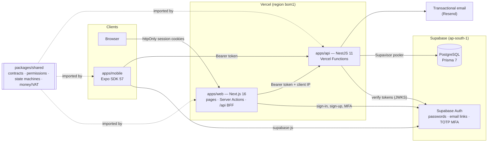

# TopFlow Hub — B2B/B2C commerce platform for Top Flow

> **Portfolio project.** Built independently by Farah Sharif, with Top Flow's permission to use its name and product catalogue. This is not Top Flow's official online store.

> **Top Flow — Irrigation & Flow Control Supplies, UAE** supplies electrofusion and HDPE fittings, sprinklers and rotors, drip irrigation, pipes and fittings, valves, filtration and landscaping products to two very different audiences:

- **Consumers** who want to buy a few rotors for a villa garden online, at VAT-inclusive prices, paying on delivery.
- **Businesses** — landscapers, MEP contractors, facility managers, developers — who buy for projects through **quotations**, negotiated prices, **purchase approvals** and **credit terms**.

**TopFlow Hub** serves both: a storefront with approximate prices and quote requests, a trade portal, a back office for Top Flow's teams and a mobile app. This monorepo contains all of them and the shared domain contracts that keep them consistent.

| Environment | Web app | API |
| --- | --- | --- |
| Local | http://localhost:3002 | http://localhost:3000 (`/docs`) |

> Nothing is hosted yet: the platform runs locally. The hosting options and their trade-offs are recorded in [ADR-019](docs/DECISIONS.md).

## Try the demo

> **Not hosted yet.** There is no public demo address today. Demo mode and the nightly reset are built and tested locally and in CI, but no demo deployment exists and the reset has never run against a hosted database. This section describes how the demo will work and how to run the same demo mode on your own machine.

The public demo will be the production build with demo mode switched on (`DEMO_MODE=true` in the API, `NEXT_PUBLIC_DEMO_MODE=true` in the web app), on a Supabase project of its own:

- Every page says *"Portfolio demo: data resets every night. This is not Top Flow's official store."*, and search engines are asked not to index the site.
- You sign in with the published [demo accounts](#demo-accounts), from the retail customer to the administrator. They share the password `TopFlow2026!`, and the sign-in page lists them.
- The demo emails nobody outside a short allow-list. Business emails (quote acknowledgements, quotations, order updates, team invitations) are withheld, staff and customer invitations are refused, and sign-up and password reset emails are switched off.
- The demo accounts cannot be suspended or change role, and their passwords and two-factor settings are fixed. Rate limits stay on.
- Every night at 03:00 UAE time, a GitHub Actions workflow runs `npm run demo:reset`, which empties the database, deletes every sign-in and loads the demo data again.

**Demo mode on your machine.** After [Getting started](#getting-started), set `DEMO_MODE=true` and `STAFF_MFA_REQUIRED=false` in `apps/api/.env` and `NEXT_PUBLIC_DEMO_MODE=true` in `apps/web/.env.local`, then run `npm run dev`. `DEMO_MODE=true npm run demo:reset -- --confirm` returns the local database to the demo data set; with Supabase keys in `packages/database/.env` it also replaces the local sign-ins.

Why it works this way: [ADR-021](docs/DECISIONS.md). How to host it and what it does not prevent: [operations runbook, section 10](docs/OPERATIONS.md#10-public-demo).

---

## Highlights

| Capability | What it does |
| --- | --- |
| **Catalogue** | Top Flow's range of 323 products in 9 categories and 41 product lines, with photos and specifications. Each product shows an approximate price range (**≈ AED min – max**, VAT included), and search covers names, codes and tags. See [packages/database/prisma/data](packages/database/prisma/data/README.md). |
| **Quote requests** | Anyone can send their basket for a quotation — or describe a project without choosing products — with a preferred contact channel and a required-by date. Requests land in the sales inbox next to trade RFQs, and the visitor gets an acknowledgement. |
| **Retail (B2C)** | VAT-inclusive prices, a guest basket, server-priced checkout (cash or card on delivery), and order tracking with a full status timeline. |
| **Procurement (B2B)** | Organizations with Owner / Approver / Buyer roles, RFQs, **versioned quotations** with **PDF** generation, accept / reject / request-revision, **spending-limit approvals** (segregation of duties), and sales orders released on the organization's **credit terms**. |
| **Multi-tenancy** | Every B2B request runs inside a verified organization context (`x-organization-id`). Users can belong to several organizations, and Top Flow staff verify each company (KYC). |
| **Operations** | Role-based back office for Sales, Warehouse and Admin: KYC queue, quotation builder, fulfilment state machine, stock deduction at dispatch, low-stock alerts, dashboard KPIs, staff invitations and an immutable audit trail. |
| **Identity & security** | **Supabase Auth** with email confirmation, password recovery and **two-factor authentication required for staff**. Web sessions live in httpOnly cookies behind a backend-for-frontend; the API verifies Supabase tokens (JWKS) and enforces RBAC and tenant isolation. Platform tables are locked away from Supabase's public Data API, rate limits apply per client, and prices are never trusted from clients. |
| **Engineering** | Turborepo monorepo, shared **Zod contracts + workflow state machines + integer money/VAT maths** used by API, web and mobile, compile-time enum parity with Prisma, data-preserving migrations, unit and end-to-end tests, CI, and nightly **encrypted off-site database backups**. |

## Architecture


```mermaid
flowchart LR
  subgraph Clients
    BROWSER["Browser"]
    MOB["apps/mobile<br/>Expo SDK 57"]
  end
  subgraph Vercel["Vercel (region bom1)"]
    WEB["apps/web — Next.js 16<br/>pages · Server Actions · /api BFF"]
    API["apps/api — NestJS 11<br/>Vercel Functions"]
  end
  subgraph Supabase["Supabase (ap-south-1)"]
    AUTH["Supabase Auth<br/>passwords · email links · TOTP MFA"]
    DB[("PostgreSQL<br/>Prisma 7")]
  end
  SHARED[["packages/shared<br/>contracts · permissions · state machines · money/VAT"]]
  MAIL["Transactional email<br/>(Resend)"]

  BROWSER -- "httpOnly session cookies" --> WEB
  WEB -- "sign-in, sign-up, MFA" --> AUTH
  WEB -- "Bearer token + client IP" --> API
  MOB -- "supabase-js" --> AUTH
  MOB -- "Bearer token" --> API
  API -- "verify tokens (JWKS)" --> AUTH
  API -- "Supavisor pooler" --> DB
  API --> MAIL
  SHARED -. imported by .-> WEB
  SHARED -. imported by .-> MOB
  SHARED -. imported by .-> API
```

Read more in [docs/ARCHITECTURE.md](docs/ARCHITECTURE.md) (data model, workflows, authentication, tenancy), the [design decisions](docs/DECISIONS.md) and the [operations runbook](docs/OPERATIONS.md).

## Repository layout

```
apps/
  api/        NestJS REST API (Swagger at /docs outside production), deployed as a Vercel Function
  web/        Next.js storefront, trade portal (/business) and back office (/admin), deployed to Vercel
  mobile/     Expo React Native app
packages/
  shared/     @topflow/shared — enums, permissions, workflows, money/VAT, Zod schemas, DTO types
  database/   @topflow/database — Prisma schema, migrations, seed, demo reset, generated client
supabase/     Supabase configuration: auth policy, branded email templates, storage buckets
docs/         Architecture, decisions, operations runbook, academic evolution
```

## Tech stack

| Layer | Technology |
| --- | --- |
| Language | TypeScript everywhere (strict) |
| API | NestJS 11, Zod (`nestjs-zod`), Swagger/OpenAPI, `jose`, `@nestjs/throttler`, Helmet, PDFKit |
| Identity | Supabase Auth (`@supabase/ssr` on the web, `@supabase/supabase-js` on mobile and for administration) |
| Data | Supabase PostgreSQL, Prisma 7 with the `pg` driver adapter |
| Web | Next.js 16 (App Router, Turbopack), React 19, Tailwind CSS 4, Lucide icons |
| Mobile | Expo SDK 57, Expo Router, SecureStore |
| Hosting | Vercel (web and API on Fluid compute), Supabase |
| Tooling | npm workspaces, Turborepo, ESLint, Prettier, Jest, Supertest, GitHub Actions |

## Getting started

**Prerequisites:** Node.js 22+ (24 recommended), npm 11 and Docker Desktop (for the local Supabase stack).

```bash
npm install

# 1. Start Supabase locally: PostgreSQL, Auth, Storage, Studio and a mail catcher
npm run supabase:start
npx supabase status             # URLs and keys for the next step

# 2. Configure the apps (see the comments in each example file)
cp apps/api/.env.example apps/api/.env
cp apps/web/.env.example apps/web/.env.local
#    packages/database/.env needs DATABASE_URL, SUPABASE_URL and SUPABASE_SECRET_KEY

# 3. Create the schema and load demo data (this also creates the demo sign-ins)
npm run db:deploy
npm run db:seed

# 4. Run everything (API :3000, web :3002)
npm run dev
```

| Local service | URL |
| --- | --- |
| Web app | http://localhost:3002 |
| API docs | http://localhost:3000/docs |
| Supabase Studio | http://127.0.0.1:54323 |
| Emails sent by the stack | http://127.0.0.1:54324 |

### Demo accounts

Locally, every seeded account uses the password `TopFlow2026!`. Because that password is public, a shared or production environment must be seeded with its own `SEED_DEMO_PASSWORD` (see `.env.example`). The public demo is the exception: its password is published on purpose, and its data resets every night ([Try the demo](#try-the-demo)). With `STAFF_MFA_REQUIRED=true`, staff accounts are asked to set up an authenticator app the first time they open the back office.

| Email | Role | Try |
| --- | --- | --- |
| `customer@example.com` | Retail customer | Checkout, order tracking |
| `buyer@desertbloom.ae` | Trade **buyer** (AED 5,000 limit) | RFQs, accepting quotations |
| `approver@desertbloom.ae` | Trade **approver** (AED 50,000 limit) | Approving purchases above the buyer's limit |
| `owner@desertbloom.ae` | Trade **owner** | Team invitations, delivery sites, company profile |
| `sales@topflow.ae` | Top Flow sales | KYC, RFQ triage, quotation builder |
| `warehouse@topflow.ae` | Top Flow warehouse | Fulfilment, stock |
| `admin@topflow.ae` | Administrator | Everything, including staff invitations and the audit trail |

## Quality

```bash
npm run check-types                     # all workspaces
npm run lint
npm test                                # unit tests (shared contracts, database scripts, API)
npm run test:e2e -w @topflow/api        # end-to-end suites against a real database
```

- **Unit tests** cover money/VAT maths, workflow state machines, the permission matrix, request schemas, Supabase token verification, guards, error mapping and configuration, plus the demo's mail guard, its invitation rules and the safety checks of `npm run demo:reset`.
- **End-to-end tests** boot the real application (the production middleware stack) against PostgreSQL. They simulate Supabase Auth with locally signed tokens and exercise account provisioning, token rejection, staff MFA, staff invitations and suspension, team invitations, RBAC, tenant isolation, the full RFQ → quotation → approval → order flow, website quote requests and retail fulfilment. A test also asserts that every table has Row Level Security enabled. A second suite boots the API in demo mode and checks that visitors and Top Flow's inbox receive no email, that invitations are refused, that the demo accounts stay usable and that rate limits still apply.
- **CI** (`.github/workflows/ci.yml`) runs lint, type checks, unit tests and builds for every workspace, plus the end-to-end suites against a PostgreSQL service container after running the real demo reset on it.

## Deployment

The platform is deployment-ready but not hosted yet. [ADR-019](docs/DECISIONS.md) records the trade-offs: Vercel's free plan allows non-commercial use only, few free plans fit a server-rendered app with its own API, and Netlify's free plan is the default if the platform is published as a business site.

| Piece | Intended home |
| --- | --- |
| Web and API | one host with serverless functions — Netlify's free plan, or Vercel Pro / Google Cloud Run where a card and a small bill are acceptable |
| Database, authentication and storage | Supabase, whose free plan places no restriction on business use |
| Backups | GitHub Actions: a nightly `supabase db dump`, encrypted with age and kept for 30 days |
| Public demo | A separate deployment in demo mode with its own Supabase project, reset every night by GitHub Actions ([Try the demo](#try-the-demo)) |

Nothing in the code depends on a particular host: the environment is validated at boot, and `npm run release` applies migrations before a new version serves traffic.

Versions and the changelog come from [release-please](https://github.com/googleapis/release-please): it keeps a release pull request open against `develop`, and merging it tags the release. The first one will be `v1.0.0`; no release has been tagged yet.

Configuration, releases, backups, restores and secret rotation are described in [docs/OPERATIONS.md](docs/OPERATIONS.md).

## From academic prototype to production

The original coursework was a Kotlin/Firebase Android app for a bicycle shop. [docs/ACADEMIC-EVOLUTION.md](docs/ACADEMIC-EVOLUTION.md) maps each prototype feature — and each of its engineering shortcuts, such as a hard-coded `admin/admin` login, card numbers typed into the app and totals computed on the device — to the production design used here.
