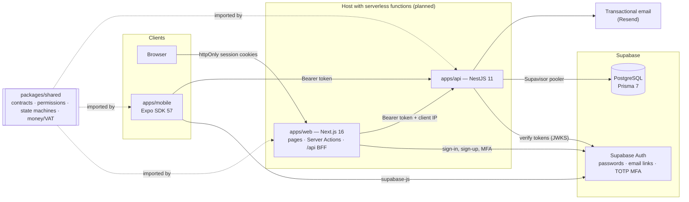

# TopFlow Hub: a portfolio B2B/B2C commerce platform built on Top Flow's catalogue

A monorepo with a storefront, a trade portal, a back office, an API and a mobile app for a UAE irrigation supplier, covering quotations, purchase approvals and credit terms as well as retail orders.

[](https://github.com/fasharif/topflow/actions/workflows/ci.yml)

> **Portfolio project.** Built independently by Farah Sharif, with Top Flow's permission to use its name and product catalogue. This is not Top Flow's official online store, and nothing is hosted yet.


*The sign-in page of a local demo build (`NEXT_PUBLIC_DEMO_MODE=true`), captured with headless Chromium on 26 September 2026. It is not a hosted site.*


| Storefront | Trade purchase waiting for approval | Warehouse fulfilment |
| --- | --- | --- |
|  |  |  |

Also: a [product page](docs/screenshots/product.png) with its approximate price range and the [KYC review](docs/screenshots/kyc-review.png) of a new trade account. The screenshots and the GIF are captured from the demo data and a local demo build (`NEXT_PUBLIC_DEMO_MODE=true`, hence the banner) with `npm run screenshots` and `npm run walkthrough:gif` in the [system-test workspace](tests/README.md).

## The problem

**Top Flow — Irrigation & Flow Control Supplies, UAE** sells electrofusion and HDPE fittings, sprinklers and rotors, drip irrigation, pipes and fittings, valves, filtration and landscaping products to two very different audiences:

- **Consumers** who want to buy a few rotors for a villa garden online, at VAT-inclusive prices, paying on delivery.
- **Businesses** — landscapers, MEP contractors, facility managers, developers — who buy for projects through **quotations**, negotiated prices, **purchase approvals** and **credit terms**.

A plain web shop serves the first group only. **TopFlow Hub** serves both: a storefront with approximate prices and quote requests, a trade portal, a back office for Top Flow's teams and a mobile app, all built on one set of shared domain contracts so prices, VAT and workflow rules agree everywhere.

## Features

| Capability | What it does |
| --- | --- |
| **Catalogue** | 346 products in 11 categories and 61 product lines: 241 from Top Flow's own catalogue and 105 typical products of the UAE irrigation market with estimated prices, all with photos or drawn illustrations and specifications. Each product shows an approximate price range (**≈ AED min – max**, VAT included), and search covers names, codes and tags. Counted from `packages/database/prisma/data/topflow-catalogue.json`; sources and licensing in [its README](packages/database/prisma/data/README.md). |
| **Quote requests** | Anyone can send their basket for a quotation — or describe a project without choosing products — with a preferred contact channel and a required-by date. Requests land in the sales inbox next to trade RFQs, and the visitor gets an acknowledgement. |
| **Retail (B2C)** | VAT-inclusive prices, a guest basket, server-priced checkout (cash or card on delivery), and order tracking with a full status timeline. |
| **Procurement (B2B)** | Organisations with Owner / Approver / Buyer roles, RFQs, **versioned quotations** with **PDF** generation, accept / reject / request-revision, **spending-limit approvals** (segregation of duties), and sales orders released on the organisation's **credit terms**. |
| **Multi-tenancy** | Every B2B request runs inside a verified organisation context (`x-organization-id`). Users can belong to several organisations, and Top Flow staff verify each company (KYC). |
| **Operations** | Role-based back office for Sales, Warehouse and Admin: KYC queue, quotation builder, fulfilment state machine, stock deduction at dispatch, low-stock alerts, dashboard KPIs, staff invitations and an immutable audit trail. |
| **Identity & security** | **Supabase Auth** with email confirmation, password recovery and **two-factor authentication required for staff**. Web sessions live in httpOnly cookies behind a backend-for-frontend; the API verifies Supabase tokens (JWKS) and enforces RBAC and tenant isolation. Platform tables are locked away from Supabase's public Data API, rate limits apply per client, and prices are never trusted from clients. |
| **Public demo mode** | One setting per app turns a production build into the portfolio demo described above: a mail guard with an allow-list, refused invitations, fixed demo accounts and demo company, a banner and noindex, and a guarded nightly reset. |
| **Engineering** | Turborepo monorepo, shared **Zod contracts + workflow state machines + integer money/VAT maths** used by API, web and mobile, compile-time enum parity with Prisma, data-preserving migrations, unit and end-to-end tests, CI, nightly **encrypted off-site database backups**, and versioning with release-please. |

## Architecture


```mermaid
flowchart LR
  subgraph Clients
    BROWSER["Browser"]
    MOB["apps/mobile<br/>Expo SDK 57"]
  end
  subgraph Host["Host with serverless functions (planned)"]
    WEB["apps/web — Next.js 16<br/>pages · Server Actions · /api BFF"]
    API["apps/api — NestJS 11"]
  end
  subgraph Supabase["Supabase"]
    AUTH["Supabase Auth<br/>passwords · email links · TOTP MFA"]
    DB[("PostgreSQL<br/>Prisma 7")]
  end
  SHARED[["packages/shared<br/>contracts · permissions · state machines · money/VAT"]]
  MAIL["Transactional email<br/>(Resend)"]

  BROWSER -- "httpOnly session cookies" --> WEB
  WEB -- "sign-in, sign-up, MFA" --> AUTH
  WEB -- "Bearer token + client IP" --> API
  MOB -- "supabase-js" --> AUTH
  MOB -- "Bearer token" --> API
  API -- "verify tokens (JWKS)" --> AUTH
  API -- "Supavisor pooler" --> DB
  API --> MAIL
  SHARED -. imported by .-> WEB
  SHARED -. imported by .-> MOB
  SHARED -. imported by .-> API
```

The browser never holds a token: the web app's server keeps the Supabase session in httpOnly cookies and forwards API calls with the access token (ADR-013). The API authorises every request itself, with roles, organisation permissions and tenant checks. Read more in [docs/ARCHITECTURE.md](docs/ARCHITECTURE.md) (data model, workflows, authentication, tenancy).

## Tech stack

| Layer | Technology | Why |
| --- | --- | --- |
| Language | TypeScript everywhere (strict) | One language across API, web and mobile, so the shared contracts are checked by the compiler in every app. |
| API | NestJS 11, Zod (`nestjs-zod`), Swagger/OpenAPI, `jose`, `@nestjs/throttler`, Helmet, PDFKit | Modules, guards and dependency injection suit a modular monolith with RBAC and tenancy (ADR-001); Zod schemas are shared with the clients. |
| Identity | Supabase Auth (`@supabase/ssr` on the web, `@supabase/supabase-js` on mobile and for administration) | Email links, TOTP and session handling without running an identity service; the API keeps authorisation (ADR-012). |
| Data | Supabase PostgreSQL, Prisma 7 with the `pg` driver adapter | Transactions for money, stock and approvals; a typed client and reviewed SQL migrations (ADR-003). |
| Web | Next.js 16 (App Router, Turbopack), React 19, Tailwind CSS 4, Lucide icons | Server-rendered catalogue pages, and Server Actions that keep authentication on the server. |
| Mobile | Expo SDK 57, Expo Router, SecureStore | One React Native codebase for Android and iOS that reuses the shared package. |
| Hosting (planned) | Serverless functions for web and API, Supabase for data | Supabase's free plan allows business use; for web and API only officially free options qualify, so the choice is deferred (ADR-019). |
| Tooling | npm workspaces, Turborepo, ESLint, Prettier, Jest, Supertest, `node:test`, GitHub Actions, release-please | Builds in dependency order with caching, and one CI workflow for every workspace. |
| Testing beyond unit tests | Playwright and axe-core (browser journeys, accessibility), k6 (load), Schemathesis (API contract), run from pinned containers where possible | Tests the running stack as users and clients meet it; the containers need only Docker (ADR-022). |

## Quick start

**Prerequisites:** Node.js 22+ (24 recommended), npm 11 and Docker Desktop (for the local Supabase stack).

```bash
npm install
npm run supabase:start   # local PostgreSQL, Auth, Storage, Studio and a mail catcher
npm run setup            # env files from the examples, local keys, migrations and demo data
npm run dev              # API on :3000, web app on :3002
```

`npm run setup` copies each `.env.example` to the file its app reads (it never overwrites one), fills in the local Supabase keys from `npx supabase status -o env` and a shared `INTERNAL_API_SECRET` where they are empty, then runs `npm run db:deploy` and `npm run db:seed`. It only loads data into a database on this machine. If it reports a key as still empty, copy it from `npx supabase status`.

| Local service | URL |
| --- | --- |
| Web app | http://localhost:3002 |
| API docs | http://localhost:3000/docs |
| Supabase Studio | http://127.0.0.1:54323 |
| Emails sent by the stack | http://127.0.0.1:54324 |

### Demo accounts

Locally, every seeded account uses the password `TopFlow2026!`. Because that password is public, a shared or production environment must be seeded with its own `SEED_DEMO_PASSWORD` (see `.env.example`). The public demo is the exception: its password is published on purpose, and its data resets every night ([Try the demo](#try-the-demo)). With `STAFF_MFA_REQUIRED=true`, staff accounts are asked to set up an authenticator app the first time they open the back office.

| Email | Role | Try |
| --- | --- | --- |
| `customer@example.com` | Retail customer | Checkout, order tracking |
| `buyer@desertbloom.example` | Trade **buyer** (AED 5,000 limit) | RFQs, accepting quotations |
| `approver@desertbloom.example` | Trade **approver** (AED 50,000 limit) | Approving purchases above the buyer's limit |
| `owner@desertbloom.example` | Trade **owner** | Team invitations, delivery sites, company profile |
| `sales@topflow.example` | Top Flow sales | KYC, RFQ triage, quotation builder |
| `warehouse@topflow.example` | Top Flow warehouse | Fulfilment, stock |
| `admin@topflow.example` | Administrator | Everything, including staff invitations and the audit trail |

The addresses use reserved example domains (RFC 2606). Desert Bloom Landscaping LLC is a fictional company.

## Try the demo

> **Not hosted yet.** There is no public demo address today. Demo mode and the nightly reset are built and tested on a local machine, and the CI workflow runs the reset and the demo checks on every push, but no demo deployment exists and the reset has never run against a hosted Supabase project. This section describes how the demo will work and how to run the same demo mode on your own machine.

The public demo will be the production build with demo mode switched on (`DEMO_MODE=true` in the API, `NEXT_PUBLIC_DEMO_MODE=true` in the web app), on a Supabase project of its own:

- Every page says *"Portfolio demo: data resets every night. This is not Top Flow's official store."*, and search engines are asked not to index the site.
- You sign in with the published [demo accounts](#demo-accounts), from the retail customer to the administrator. They share the password `TopFlow2026!`, and the sign-in page lists them. Their addresses are on reserved example domains, so they are not real mailboxes.
- The demo emails nobody outside a short allow-list. Business emails (quote acknowledgements, quotations, order updates, team invitations) are withheld, and the web app says so; staff invitations and customer invitations from website requests are refused; sign-up and password reset emails are switched off.
- The demo accounts keep their role, membership and access, and the demo company (Desert Bloom Landscaping LLC) keeps its KYC status, trading terms and TRN, so no visitor can lock the others out of the trade flow. The web app does not offer password or two-factor changes for the shared accounts; changes made by calling Supabase Auth directly are undone by the nightly reset. Rate limits stay on.
- Every night at 03:00 UAE time, a GitHub Actions workflow runs `npm run demo:reset`, which empties the database, deletes every sign-in of the demo project (after checking that the project and the database belong together) and loads the demo data again.

**Demo mode on your machine.** After the [quick start](#quick-start), set `DEMO_MODE=true` and `STAFF_MFA_REQUIRED=false` in `apps/api/.env` and `NEXT_PUBLIC_DEMO_MODE=true` in `apps/web/.env.local`, then run `npm run dev`. `DEMO_MODE=true npm run demo:reset -- --confirm` returns the local database to the demo data set, and also replaces the local sign-ins when `packages/database/.env` holds the local stack's keys.

Why it works this way: [ADR-021](docs/DECISIONS.md). How to host it and what it does not prevent: [operations runbook, section 10](docs/OPERATIONS.md#10-public-demo).

## Configuration

Each app reads its own environment file, and every variable is described in the example next to it:

| File | Example | Holds |
| --- | --- | --- |
| `apps/api/.env` | `apps/api/.env.example` | Database, Supabase URL and secret key, internal secret, rate limits, mail, demo mode, company details |
| `apps/web/.env.local` | `apps/web/.env.example` | Supabase URL and publishable key, API origin, internal secret, site URL, demo mode |
| `packages/database/.env` | `packages/database/.env.example` | Database, plus Supabase keys so the seed creates sign-ins |
| `apps/mobile/.env` | `apps/mobile/.env.example` | API, web and Supabase URLs, publishable key |

The API validates its environment at start-up and stops with a readable report when something is missing or inconsistent; `npm run release` runs the same check before migrations. Production settings, secrets, backups and secret rotation are in the [operations runbook](docs/OPERATIONS.md). Nothing secret is committed: only `.env.example` files.

## Tests

**Quality at a glance.** The latest full run, on 28 September 2026, from a clean clone on a Windows 11 laptop with Docker Desktop: the Node steps ran in a Linux container (`node:24-bookworm`) against a Supabase CLI stack and PostgreSQL 17 in Docker, as the CI workflows describe. On 3 October 2026 the k6 load profile was measured on the same laptop with nothing else running in Docker, and the Playwright suite was run again (31 passed, none retried). The workflows themselves have not run on GitHub yet ([limitations](#limitations-and-roadmap)).

| Level | Tool | Tests | Result | Details |
| --- | --- | --- | --- | --- |
| Unit | Jest, `node:test` | 254: shared 91, API 84, web 30, mobile 8, database 35, setup script 6 | all passed | [Test plan, section 9](docs/testing/TEST-PLAN.md#9-results-of-this-cycle) |
| API end-to-end | Jest, Supertest, PostgreSQL 17 | 53 | all passed; 80.8 % of API statements covered | [Test plan, section 7](docs/testing/TEST-PLAN.md#7-decision-tables-and-boundary-values) (decision tables) |
| Mutation check | `tests/scripts/mutation-check.mts` | 3 deliberate breaks of the money rules | all 3 caught | [Test plan, section 7](docs/testing/TEST-PLAN.md#7-decision-tables-and-boundary-values) |
| System | Playwright (Chromium) | 31 | all passed | [tests/README.md](tests/README.md) |
| Accessibility | axe-core | 41 pages, at desktop and phone size | no serious or critical violation | [Test plan, section 8](docs/testing/TEST-PLAN.md#8-non-functional-testing) |
| Load | k6 | 4 measured runs of 4½ minutes, about 24,500 requests each | p95 of every endpoint between 3 and 20 ms at about 90 requests a second; 1 of 97,905 requests failed | [PERFORMANCE.md](docs/testing/PERFORMANCE.md) |
| API contract | Schemathesis | 3 passes | no new failure | [Triage](docs/testing/BUGS-FOUND.md#schemathesis-triage) |
| Defects | | 17 recorded | 16 fixed; 1 of Low severity open | [BUGS-FOUND.md](docs/testing/BUGS-FOUND.md) |

The two High-severity defects were [BUG-02](docs/testing/BUGS-FOUND.md#bug-02--the-customer-can-be-charged-a-total-other-than-the-one-shown), a customer charged a total other than the one shown (now refused by the API, and fixed in the web and mobile apps), and [BUG-13](docs/testing/BUGS-FOUND.md#bug-13--two-acceptances-at-the-same-moment-pass-the-credit-limit), two quotations accepted at the same moment that together passed a company's credit limit (fixed with a row lock).

```bash
npm run check-types                     # all workspaces
npm run lint
npm test                                # unit tests of every workspace
npm run test:e2e -w @topflow/api        # end-to-end suites against a real database (DATABASE_URL)
npm run test:scripts                    # the local setup script
npm run build -w web && npm run test:demo -w web   # a build made with NEXT_PUBLIC_DEMO_MODE=true
node tests/scripts/mutation-check.mts --with-db    # breaks each money rule in turn (DATABASE_URL)
npm run e2e -w @topflow/system-tests    # browser journeys, axe scans and layout checks against the running stack
npm run load -w @topflow/system-tests       # k6 smoke run (Docker)
npm run load:check -w @topflow/system-tests # the k6 load profile gates on every p95 threshold (Docker)
K6_PROFILE=load npm run load -w @topflow/system-tests # measured load run, about five minutes (Docker)
npm run contract -w @topflow/system-tests   # Schemathesis, three passes, local stack only (Docker)
```

- **Unit tests** cover money/VAT maths, workflow state machines, the permission matrix, request schemas, the published OpenAPI description, Supabase token verification, guards, error mapping and configuration; in the web app the basket's price refresh and the order tracker; and in the mobile app the cart's totals, its price refresh and the order request, which carries the total the cart shows. For the demo they cover the mail guard, the demo policy, the demo settings, the safety checks of `npm run demo:reset` (including the check that the Supabase project and the database belong together) and every authentication Server Action of the web app in and out of demo mode.
- **End-to-end tests** boot the real application (the production middleware stack) against PostgreSQL. They simulate Supabase Auth with locally signed tokens and exercise account provisioning, token rejection, staff MFA, staff invitations and suspension, team invitations, RBAC, tenant isolation, the full RFQ → quotation → approval → order flow, website quote requests and retail fulfilment. A test also asserts that every table has Row Level Security enabled. A second suite boots the API in demo mode and checks that visitors and Top Flow's inbox receive no email, that staff and customer invitations are refused while team invitations are kept without their email, that the demo accounts and the demo company cannot be changed while other accounts and companies can, and that rate limits still apply.
- **Decision tables.** Purchase approval and release on credit terms are tested at their boundaries in unit tables (`approval.spec.ts`, `order-writer.service.spec.ts`: one fils below, at and one fils above each limit) and over HTTP on new organisations (`decision-tables.e2e-spec.ts`: below, at and above the buyer's limit; at and above the approver's and the credit limit). Five rounds of two simultaneous acceptances, each on a new company, check that orders released at the same moment cannot pass one credit limit. `tests/scripts/mutation-check.mts` then breaks each rule in turn (`>` for `>=`, `<=` for `<`, the row lock removed) and fails unless the tests catch it. Other end-to-end tests check the published OpenAPI description and that checkout refuses a total the customer was not shown.
- **System tests** ([tests/](tests/README.md)) run against the whole stack as the demo users: retail checkout (with totals also worked out by hand, and a price changed while the customer is at checkout), RFQ → approval above the buyer's limit → order, and a new company's sign-up, verification, fulfilment and stock deduction; tenant isolation, the warehouse role's limits and tampered prices; axe-core scans of 41 pages at desktop and phone size, failing on serious or critical WCAG 2.2 A/AA issues; and checks at 1280 × 720 that order and quotation lines show every total and that a table is a tab stop only while it scrolls.
- **Load tests**: k6 with p95 and failed-request thresholds per endpoint; the p95 thresholds are listed once in `tests/load/targets.json`. Four measured runs on 3 October 2026, on a laptop, put every endpoint's p95 between 3 and 20 ms at about 90 requests a second, and the thresholds were set from them at four times the highest p95 ([PERFORMANCE.md](docs/testing/PERFORMANCE.md), with the machine and the command). CI runs a smoke profile that fails on errors, not timings, and checks that the load profile still gates on every threshold.
- **Contract tests**: Schemathesis against the API's OpenAPI description in three passes: as a customer (every operation outside the trade portal), as back-office staff (read operations) and as a trade company. It runs only against a stack on the same machine, because it creates throwaway accounts, one of them an administrator, which it deactivates and deletes afterwards. Triaged findings are kept in a baseline per pass. Its coverage warnings are reported with the results and limit what the case counts mean. Of the 25 operations a customer or visitor may call, 10 mostly answered 404 for lack of test data (invitation tokens, personal quotations) or mostly received generated input that the API rejected, because rules across fields, such as "a saved address or a new one" at checkout, cannot be written in the description; in the trade pass, for a new company with no documents yet, 14 of 24 did. Case counts also vary a little between runs with the same seed. Details: [test plan, section 9](docs/testing/TEST-PLAN.md#9-results-of-this-cycle).
- **Test plan and findings**: scope, risks, environments, exit criteria, decision tables and traceability are in [docs/testing/TEST-PLAN.md](docs/testing/TEST-PLAN.md); defects found are in [docs/testing/BUGS-FOUND.md](docs/testing/BUGS-FOUND.md).
- **Demo build check.** `npm run test:demo -w web` starts the production build and checks over HTTP that a demo build shows the banner and noindex on its pages, disallows everything in `robots.txt` and shows the sign-up and reset notices; with `-- --off` it checks that an ordinary build shows none of them.
- **CI** (`.github/workflows/ci.yml`) runs lint, type checks, unit tests and builds for every workspace, the demo build check on both web builds, the k6 threshold check, and the end-to-end suites and the mutation check against a PostgreSQL service container after running the real demo reset on it, and reports the API's coverage for both suites in the job summary. `system-tests.yml` starts the stack with the Supabase CLI and runs the system tests on pull requests and `develop`; `test-report-pages.yml` publishes the Playwright report to GitHub Pages once Pages is enabled for the repository. Its status, once it has run: [](https://github.com/fasharif/topflow/actions/workflows/system-tests.yml)

## Folder structure

```
apps/
  api/        NestJS REST API (Swagger at /docs outside production)
  web/        Next.js storefront, trade portal (/business) and back office (/admin)
  mobile/     Expo React Native app
packages/
  shared/     @topflow/shared — enums, permissions, workflows, money/VAT, Zod schemas, DTO types, demo settings
  database/   @topflow/database — Prisma schema, migrations, seed, demo reset, generated client
scripts/      npm run setup for a local checkout
supabase/     Supabase configuration: auth policy, branded email templates, storage buckets
tests/        System tests: Playwright journeys with axe scans, k6 load tests, Schemathesis (tests/README.md)
docs/         Architecture, decisions, operations runbook, test plan and bug log, academic evolution
```

## Design decisions

The reasoning behind the main choices is recorded as short decision records in [docs/DECISIONS.md](docs/DECISIONS.md): among them the modular monolith (ADR-001), shared contracts (ADR-002), integer money and per-line VAT (ADR-006), immutable quotation revisions (ADR-007), Supabase Auth with authorisation kept in the API (ADR-012), httpOnly sessions behind a backend-for-frontend (ADR-013), deferred hosting (ADR-019), the public demo mode (ADR-021) and the testing strategy (ADR-022).

The original coursework was a Kotlin/Firebase Android app for a bicycle shop. [docs/ACADEMIC-EVOLUTION.md](docs/ACADEMIC-EVOLUTION.md) maps each prototype feature — and each of its engineering shortcuts, such as a hard-coded `admin/admin` login, card numbers typed into the app and totals computed on the device — to the production design used here.

## Limitations and roadmap

- **Nothing is hosted.** The platform runs locally. [ADR-019](docs/DECISIONS.md) records the hosting trade-offs: Vercel's free plan allows non-commercial use only, few free plans fit a server-rendered app with its own API, and Netlify's free plan is the default if the platform is published as a business site. The planned layout: web and API on one host with serverless functions, Supabase for the database, authentication and storage, GitHub Actions for nightly encrypted backups, and a separate demo deployment with its own Supabase project.
- **The demo has not run against Supabase.** The nightly reset's Supabase steps were tested with unit tests and by hand against a stand-in for the Auth admin API, and CI runs the rest of the reset against PostgreSQL. The first real run will be the demo project's setup ([runbook, section 10](docs/OPERATIONS.md#10-public-demo)).
- **Direct Supabase Auth calls.** The web app does not change a shared account's password or two-factor settings, but someone who calls Supabase Auth directly with the published password can, until the nightly reset. The API still enforces every business rule.
- **The mobile app has no demo mode.** Pointed at the demo, it is subject to the same API restrictions, but it shows no banner, and its sign-up and password reset go straight to Supabase, where the demo project has sign-ups switched off and emails only its own team.
- **No release yet.** release-please is configured to open a release pull request against `develop`; the first release will be `v1.0.0`, and nothing has been tagged.
- **The system-test workflows have not run on GitHub yet.** `system-tests.yml` and `test-report-pages.yml` were reproduced step by step on a local machine. Publishing the Playwright report also needs GitHub Pages to be enabled for the repository, with GitHub Actions as the source.
- **Testing gaps.** Load-test timings come from a laptop running the whole stack, not from a hosted deployment, and no test has looked for the API's capacity; Schemathesis does not fuzz the back office's writes (the API suite covers them), and its generated input rarely satisfies rules across fields, for which it has no examples or custom strategies yet; only Chromium runs; device tests of the mobile app (for example with Maestro) are out of scope for now, so its screens have no automated test.
- **One defect is open.** Any account can open any number of trade account applications ([BUG-17](docs/testing/BUGS-FOUND.md#bug-17--one-account-can-open-any-number-of-trade-account-applications), Low); the limit is a product decision still to be made.

## Licence

The code is released under the [MIT licence](LICENSE), © 2026 Farah Sharif. Top Flow's name, logo, product data and product photos are used with Top Flow's permission and are not covered by that licence.
