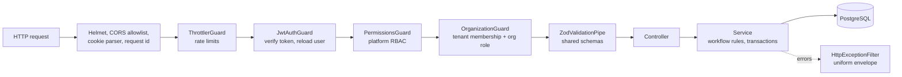
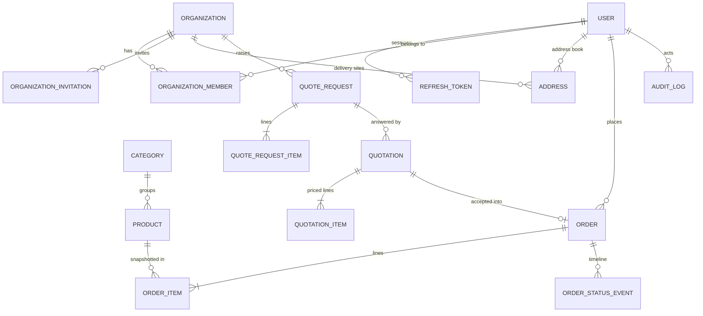
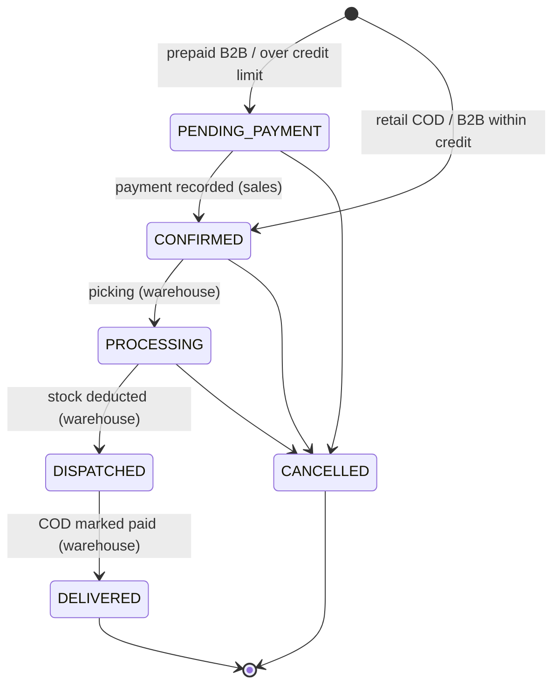
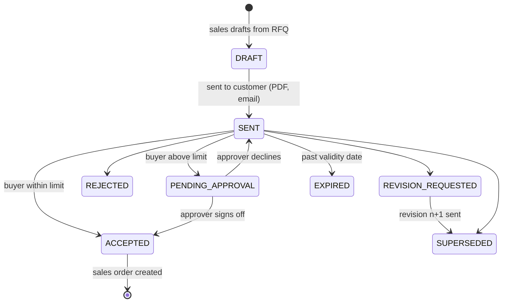
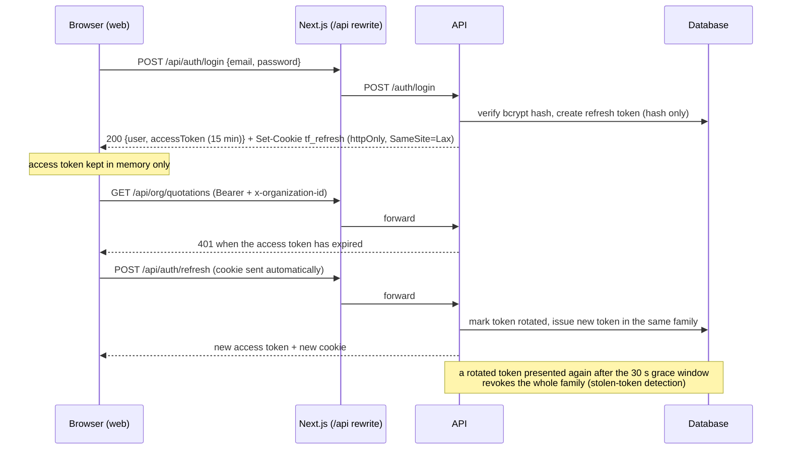

# Architecture

## 1. Shape of the system

Top Flow is a **modular monolith**: one deployable NestJS API with strict module boundaries, one Next.js web application serving three audiences, and an Expo mobile app. A shared TypeScript package carries the domain contracts, so the same rules run on the server and in every client.

| Package | Responsibility |
| --- | --- |
| `packages/database` | Prisma schema, SQL migrations, seed data, generated client (`createPrismaClient`) |
| `packages/shared` | Enums and labels, permission matrix, workflow state machines, money/VAT maths, document numbering, Zod request schemas, API response types |
| `apps/api` | REST API — authentication, tenancy, catalog, procurement, orders, back office |
| `apps/web` | Storefront, customer account, trade portal (`/business`), back office (`/admin`) |
| `apps/mobile` | Customer mobile app |

### API bounded contexts

| Module | Owns |
| --- | --- |
| `auth` | Registration (personal / business), login, refresh-token rotation, email verification, password reset, global guards |
| `users` | Profile, personal address book, staff user administration |
| `organizations` | B2B tenants, members & roles, invitations, delivery sites, KYC review |
| `catalog` | Products, categories, brands, viewer-dependent pricing (retail vs. trade) |
| `procurement` | RFQs, quotation revisions, customer responses, purchase approvals, quotation PDFs |
| `orders` | Retail checkout, order creation from quotations, fulfilment state machine, stock, payments |
| `dashboard`, `audit` | Back-office KPIs, audit trail |
| `common` | Error envelope, document numbering, serialization, request context |

## 2. Request pipeline

- Every route is authenticated unless decorated with `@Public()`.
- `@RequirePermissions(...)` checks the platform role against `ROLE_PERMISSIONS` from `@topflow/shared`.
- `@RequireOrgPermission(...)` resolves the organization from the `x-organization-id` header, verifies membership in the database, rejects suspended organizations and checks the member's organization role.
- Failures always return `{ statusCode, error, message, details?, requestId }`; database and internal errors are never leaked.

## 3. Data model

Design choices worth noting:

- **Snapshots, not references, on documents.** Order, quotation and RFQ lines copy SKU, name, unit of measure and prices; delivery addresses are stored as JSON snapshots. Editing a product or address never rewrites history.
- **Revisions as rows.** Each quotation revision is its own row sharing a `number` (`TF-QT-2026-000045`, revision 1…n).
- **Soft archive.** Products are unpublished (`isActive = false`) rather than deleted.
- **Sequential numbering.** `document_sequences` holds per-type, per-year counters incremented with an atomic `INSERT … ON CONFLICT DO UPDATE … RETURNING` inside the business transaction.
- **Audit trail.** `audit_logs` records who did what, to which entity, from which IP — written in the same transaction as the change.

## 4. Workflows

The transition maps live in `packages/shared/src/workflows` and are enforced by the API (`assertTransition`) and used by clients to decide which buttons to show.

### Sales order

### Quotation (per revision)

Segregation of duties is enforced in `QuotationsService`: a buyer's net commitment above their `approvalLimit` (or any commitment by a buyer without a limit) requires an **approver or owner who did not raise the request** and whose own limit covers the amount.

## 5. Authentication and sessions

- Mobile clients send `x-client-platform: mobile` and receive the refresh token in the body, stored in the device keychain/keystore.
- Password reset and change revoke every refresh token; `passwordChangedAt` invalidates access tokens issued earlier.
- Deactivating a user takes effect on the next request because the guard reloads the user.

## 6. Multi-tenancy

- A **tenant** is an `Organization`. Users join through `OrganizationMember` with a role (`OWNER`, `APPROVER`, `BUYER`) and an optional `approvalLimit`.
- The client selects the active tenant; the API trusts only its own membership lookup. Services receive an `OrganizationContext` and always filter by `organizationId` from that context — never from a request body.
- New business accounts start `PENDING_VERIFICATION`: they can browse trade prices only after verification, can submit RFQs, but cannot accept quotations until Top Flow sales activate them and set payment terms, credit limit and trade discount.
- Suspended organizations are blocked at the guard.

## 7. Money, VAT and documents

- Prices are stored as `DECIMAL(10,2)` **net of VAT**; all arithmetic happens in integer fils via `@topflow/shared/money`.
- VAT (5%) is calculated **per line** with half-up rounding, plus VAT on delivery, so line VAT always sums to document VAT.
- Consumers see VAT-inclusive prices (UAE requirement); trade users see net prices after their organization's discount.
- Quotation PDFs (PDFKit) show supplier and customer TRNs, revision, validity, per-line VAT, totals, terms and a watermark for drafts, superseded, rejected or expired offers.

## 8. Quality strategy

| Level | Tooling | Focus |
| --- | --- | --- |
| Static | TypeScript strict, ESLint (type-aware), compile-time Prisma ↔ shared enum parity | Contract drift, unsafe code |
| Unit | Jest | Money/VAT, state machines, permissions, schemas, token rotation, guards, error mapping, config |
| End-to-end | Jest + Supertest against PostgreSQL | Real middleware stack: auth flows, RBAC, tenant isolation, procurement and fulfilment journeys |
| Delivery | GitHub Actions, Docker (`turbo prune`) | Every push builds, lints, tests and packages the API |

## 9. Operations

- **Configuration** is validated with Zod at boot (`apps/api/src/config/env.ts`); production refuses weak JWT secrets.
- **Health:** `GET /health` (liveness) and `GET /health/ready` (database) for load balancers.
- **Tracing:** every response carries `x-request-id`, also included in error bodies and server logs.
- **Migrations** run with `prisma migrate deploy` when the container starts (guarded by Prisma's advisory lock).
- **Rate limiting:** global per-IP limits plus stricter limits on credential endpoints (in-memory store; use a shared store such as Redis when running multiple API instances).
