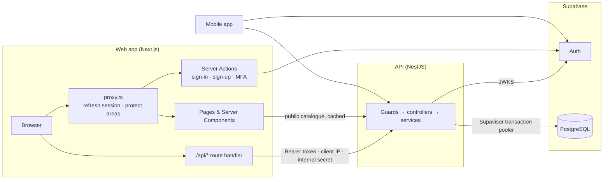
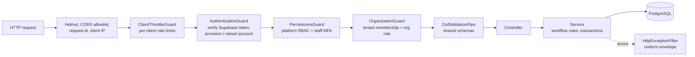
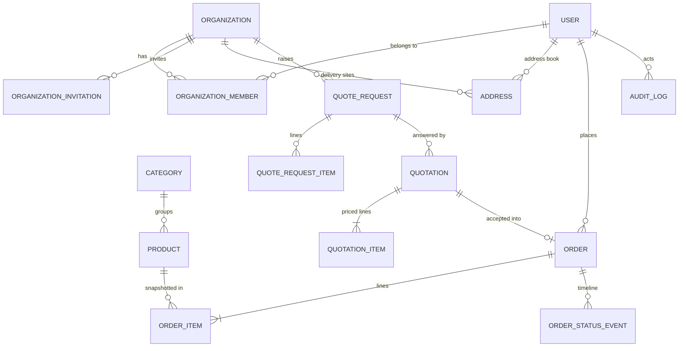
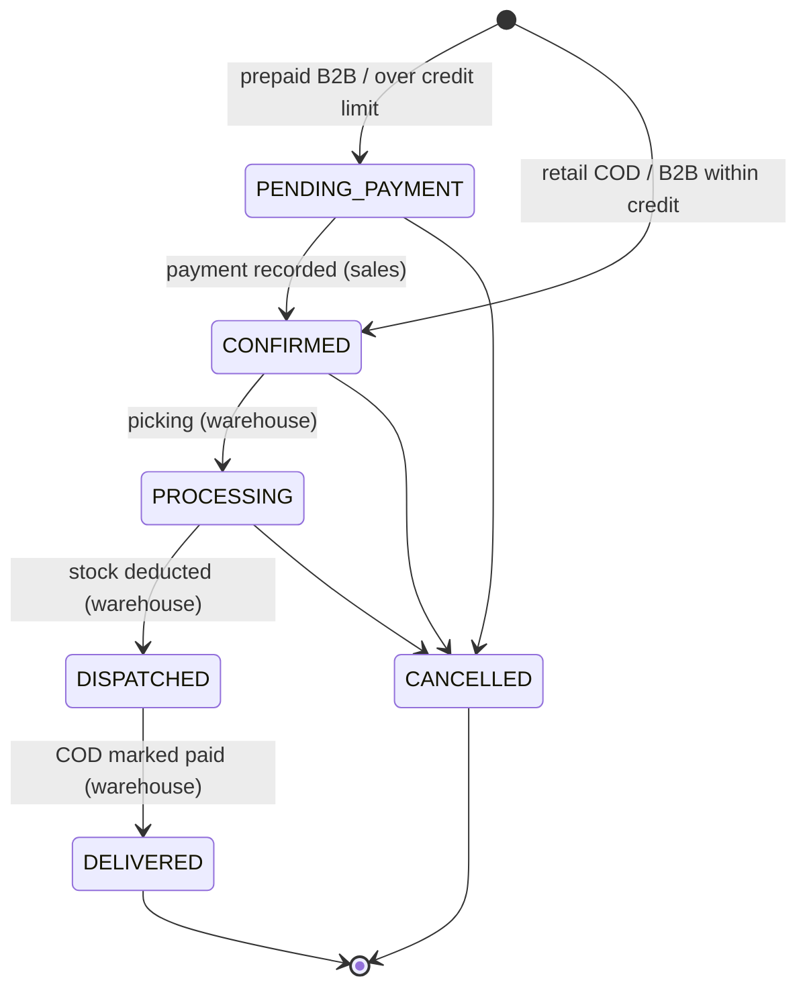
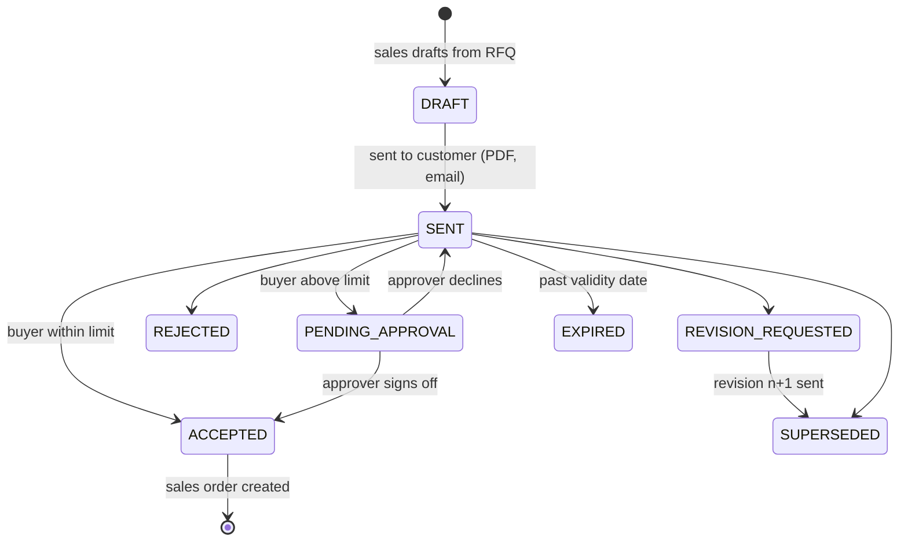
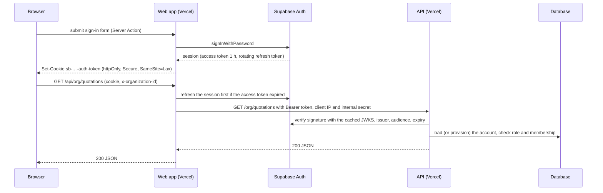

# Architecture

## 1. Shape of the system

TopFlow Hub is a **modular monolith**: one NestJS API with strict module boundaries, one Next.js web application serving three audiences, and an Expo mobile app. A shared TypeScript package carries the domain contracts, so the same rules run on the server and in every client. Supabase provides identity and the PostgreSQL database; Vercel runs both the web app and the API.

| Package | Responsibility |
| --- | --- |
| `packages/database` | Prisma schema, SQL migrations, seed data, generated client (`createPrismaClient`) |
| `packages/shared` | Enums and labels, permission matrix, workflow state machines, money/VAT maths, document numbering, Zod request schemas, API response types |
| `apps/api` | REST API — account provisioning and authorization, tenancy, catalog, procurement, orders, back office |
| `apps/web` | Storefront, customer account, trade portal (`/business`), back office (`/admin`), and the backend-for-frontend (`/api/*`) |
| `apps/mobile` | Customer mobile app |
| `supabase/` | Supabase Auth policy, branded email templates, storage buckets (`supabase config push`) |

### API bounded contexts

| Module | Owns |
| --- | --- |
| `auth` | Supabase access-token verification, account provisioning, Supabase Auth administration, the global authentication / RBAC / tenant guards, `GET /auth/me` |
| `users` | Profile, trade-account opening, personal address book, staff invitations and suspension |
| `organizations` | B2B tenants, members & roles, invitations, delivery sites, KYC review |
| `catalog` | Products, categories, brands, viewer-dependent pricing (retail vs. trade) |
| `procurement` | RFQs and website quote requests, quotation revisions, customer responses, purchase approvals, quotation PDFs |
| `orders` | Retail checkout, order creation from quotations, fulfilment state machine, stock, payments |
| `dashboard`, `audit` | Back-office KPIs, audit trail |
| `common` | Error envelope, document numbering, serialization, request context, client-IP resolution, rate limiting |

## 2. Hosting topology

> **Status (16 September 2026):** nothing is hosted yet. Everything runs locally against the Supabase CLI stack; the diagram is the intended deployment, and the reasoning is in ADR-019 of [DECISIONS.md](DECISIONS.md).

- Compute and the database belong in the same region, the closest pair to the UAE, so API ↔ database round trips stay short.
- The API is built to run as a serverless function: its `pg` pool releases idle connections before an instance is suspended (`attachDatabasePool` when it runs on Vercel), the runtime connection string uses Supabase's transaction pooler (port 6543), and migrations use a session connection (`DIRECT_URL`, port 5432).

## 3. Request pipeline (API)

- Every route requires a Supabase access token unless decorated with `@Public()`; a valid token on a public route still identifies the caller (for trade prices).
- `@RequirePermissions(...)` checks the platform role against `ROLE_PERMISSIONS` from `@topflow/shared`. With `STAFF_MFA_REQUIRED=true`, staff also need a session verified with a second factor (`aal2`); otherwise the API answers `403` with `code: "MFA_REQUIRED"`.
- `@RequireOrgPermission(...)` resolves the organization from the `x-organization-id` header, verifies membership in the database, rejects suspended organizations and checks the member's organization role.
- Failures always return `{ statusCode, error, message, code?, details?, requestId }`; database and internal errors are never leaked.

## 4. Data model

Design choices worth noting:

- **Identity lives in Supabase.** `users.id` equals `auth.users.id`; the platform table keeps only the profile and authorization data (role, active flag, memberships). Credentials, sessions, one-time links and MFA factors belong to Supabase Auth.
- **Snapshots, not references, on documents.** Order, quotation and RFQ lines copy SKU, name, unit of measure and prices; delivery addresses are stored as JSON snapshots. Editing a product or address never rewrites history.
- **Revisions as rows.** Each quotation revision is its own row sharing a `number` (`TF-QT-2026-000045`, revision 1…n).
- **Soft archive.** Products are unpublished (`isActive = false`) rather than deleted.
- **Sequential numbering.** `document_sequences` holds per-type, per-year counters incremented with an atomic `INSERT … ON CONFLICT DO UPDATE … RETURNING` inside the business transaction.
- **Audit trail.** `audit_logs` records who did what, to which entity, from which IP — written in the same transaction as the change.
- **Locked-down tables.** Every table has Row Level Security enabled with no policies, and the Data API roles have no privileges: only the API's database role can read or write platform data.

## 5. Workflows

The transition maps live in `packages/shared/src/workflows` and are enforced by the API (`assertTransition`) and used by clients to decide which buttons to show.

### Sales order

### Quotation (per revision)

Segregation of duties is enforced in `QuotationsService`: a buyer's net commitment above their `approvalLimit` (or any commitment by a buyer without a limit) requires an **approver or owner who did not raise the request** and whose own limit covers the amount.

## 6. Authentication and sessions

- **No token in browser JavaScript.** Supabase runs only on the web server (Server Actions, Route Handlers, `proxy.ts`), so its session cookies are httpOnly. Client code calls `/api/*` on its own origin; the route handler adds the token. State-changing requests from other origins are refused (Origin check on top of `SameSite=Lax`).
- **Email links** (sign-up confirmation, password recovery, staff invitation, email change) land on `/auth/confirm`, which verifies the token hash and starts the session; recovery and invitation links continue to `/auth/set-password`.
- **Provisioning.** The first request of a new identity creates the platform account with the same id, from the sign-up metadata. A business sign-up also creates its organization, pending verification.
- **Two-factor authentication.** Staff are sent to `/auth/mfa`, which enrols an authenticator app (TOTP) or verifies a code; the session is then upgraded to `aal2`. Customers can turn it on from their account page.
- **Suspension.** Deactivating a user blocks every API request immediately (the account is re-read per request) and bans the Supabase identity so no new session or refresh succeeds.
- **Mobile.** `supabase-js` keeps the session encrypted at rest (AES key in SecureStore, ciphertext in AsyncStorage), refreshes it while the app is in the foreground and sends the access token as a Bearer header.

## 7. Multi-tenancy

- A **tenant** is an `Organization`. Users join through `OrganizationMember` with a role (`OWNER`, `APPROVER`, `BUYER`) and an optional `approvalLimit`.
- The client selects the active tenant; the API trusts only its own membership lookup. Services receive an `OrganizationContext` and always filter by `organizationId` from that context — never from a request body.
- New business accounts start `PENDING_VERIFICATION`: they can submit RFQs, but cannot accept quotations until Top Flow sales activate them and set payment terms, credit limit and trade discount.
- Suspended organizations are blocked at the guard.

## 8. Money, VAT and documents

- Prices are stored as `DECIMAL(10,2)` **net of VAT**; all arithmetic happens in integer fils via `@topflow/shared/money`.
- VAT (5%) is calculated **per line** with half-up rounding, plus VAT on delivery, so line VAT always sums to document VAT.
- Consumers see VAT-inclusive approximate ranges (UAE requirement); trade users see net prices after their organization's discount.
- Quotation PDFs (PDFKit) show supplier and customer TRNs, revision, validity, per-line VAT, totals, terms and a watermark for drafts, superseded, rejected or expired offers.

## 9. Quality strategy

| Level | Tooling | Focus |
| --- | --- | --- |
| Static | TypeScript strict, ESLint (type-aware), compile-time Prisma ↔ shared enum parity | Contract drift, unsafe code |
| Unit | Jest | Money/VAT, state machines, permissions, schemas, Supabase token verification, guards, error mapping, config |
| End-to-end | Jest + Supertest against PostgreSQL | Real middleware stack with simulated Supabase Auth: provisioning, MFA, invitations, RBAC, tenant isolation, procurement and fulfilment journeys, RLS lockdown |
| Delivery | GitHub Actions | Every push lints, type-checks, tests and builds every workspace; nightly encrypted backups |

## 10. Operations

- **Configuration** is validated with Zod at boot (`apps/api/src/config/env.ts`); production refuses to start without the Supabase secret key, an https Supabase URL and the internal secret.
- **Releases.** Vercel builds the API from the repository root; on production deployments `apps/api/scripts/release.mjs` runs the environment preflight and `prisma migrate deploy` before the new version receives traffic. A failed release leaves the previous deployment serving.
- **Health:** `GET /health` (liveness) and `GET /health/ready` (database).
- **Tracing:** every response carries `x-request-id`, also included in error bodies and server logs.
- **Rate limiting:** per-client limits, stricter on public forms. The web app's server forwards the shopper's IP with a shared secret (`INTERNAL_API_SECRET`); server-rendered catalogue fetches carry the secret without an IP and are not limited. The store is in memory per instance — move it to a shared store if abuse patterns require global limits.
- **Backups:** a nightly GitHub Actions job dumps roles, schema and data with the Supabase CLI and uploads an age-encrypted archive. Restore steps are in [OPERATIONS.md](OPERATIONS.md).
