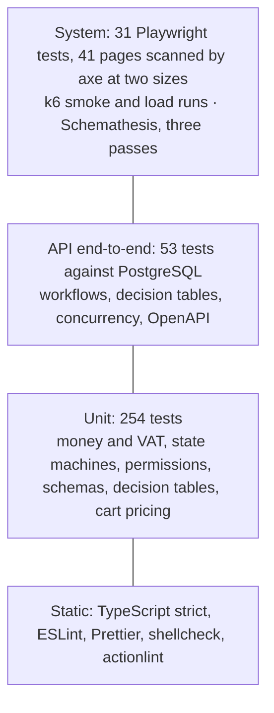

# Test plan

How TopFlow Hub is tested: what is in scope, which risks drive the tests, how the levels fit together, where the tests run, when a change is ready to merge, and which test covers which feature. The strategy is recorded in ADR-022 of [DECISIONS.md](../DECISIONS.md); defects found are in [BUGS-FOUND.md](BUGS-FOUND.md) and load-test targets in [PERFORMANCE.md](PERFORMANCE.md).

TopFlow Hub is a portfolio project built with Top Flow's permission; every account, company and document in the test data is fictional.

## 1. Scope

**In scope**

| Area | Tested through |
| --- | --- |
| Shared domain rules (`@topflow/shared`): money and VAT, state machines, permissions, request schemas, purchase approval | Unit tests |
| API (NestJS): guards, workflows, pricing, credit release, OpenAPI description | Unit tests, end-to-end tests over HTTP against PostgreSQL |
| Web app (Next.js): storefront, customer account, trade portal, back office, the `/api` backend-for-frontend | Unit tests of the basket and the order tracker; Playwright against the running stack, Chromium at desktop and phone size |
| Mobile app (Expo): the cart's totals and price refresh, and the order request | Unit tests with Node's test runner (`apps/mobile/src/lib/cart-pricing.spec.ts`) |
| Identity with Supabase Auth: sign-in, sign-up with email confirmation, sessions in httpOnly cookies | Playwright against a real local Supabase Auth; token verification in the API suites |
| Accessibility and layout | axe-core scans (WCAG 2.2 A and AA rules); a layout check at 1280 × 720 |
| Performance of key API endpoints | k6 load test with p95 thresholds |
| API contract | Schemathesis against the published OpenAPI description, in three passes (customer, staff, trade), on a local stack only |
| Database lockdown (Row Level Security) | API end-to-end test |

**Out of scope for now**

| Area | Reason, and what covers it today |
| --- | --- |
| Mobile app on devices (for example Maestro flows on an Android emulator or iOS simulator) | Needs emulators or devices in CI. The app shares `@topflow/shared` and the API with the web app, both tested above; CI type-checks it and runs the unit tests of its cart pricing. Its screens, including the checkout's handling of a changed price, have no automated test |
| Firefox and WebKit | Not run yet: a decision to keep the run short, not evidence that the pages behave the same in those browsers. Another browser is one more project in `tests/playwright.config.ts` |
| Real email delivery (Resend) and SMTP | The API uses the console transport and Supabase sends to Mailpit; templates are checked by reading Mailpit |
| Online card payments | Not offered (payment on delivery, bank transfer and credit only) |
| Fuzzing the back office's writes | Schemathesis would change the shared demo catalogue, users and companies; the API end-to-end suite covers these operations |
| Hosting, backups and restores | Nothing is hosted (ADR-019); the backup workflow is covered in OPERATIONS.md |
| Manual accessibility audit with screen readers, visual regression, penetration testing | Automated scans find only part of the accessibility issues; these belong to a release checklist, not to every change |

## 2. Risks

Likelihood and impact are each scored 1 (low), 2 (medium) or 3 (high). The score is their product, and the level follows from it: 1 or 2 is Low, 3 or 4 is Medium, 6 or 9 is High. Risks are listed by score, and the tests for the High ones were written first. The likelihood of R10 rests on the measured load runs of 3 October 2026 (PERFORMANCE.md), which cover the API on a laptop but not the pages or a hosted deployment, so it stays at 2.

| ID | Risk | Likelihood | Impact | Score | Level | Tests that address it |
| --- | --- | ---: | ---: | ---: | --- | --- |
| R1 | A customer is charged, or shown, a price other than the catalogue or quoted price | 2 | 3 | 6 | High | Retail checkout journey (with totals worked out by hand); changed-price journey; tampered-price check; API checkout tests (server pricing, changed total refused); mobile order request unit tests; decision tables; BUG-02 |
| R3 | Goods are released on credit beyond a company's credit limit, including by orders released at the same moment | 2 | 3 | 6 | High | Decision table B (unit and HTTP); two simultaneous acceptances against one limit (API, five rounds, a new company each); mutation check; procurement and company journeys; BUG-13 |
| R6 | Stock is deducted twice, never, or at the wrong step | 2 | 2 | 4 | Medium | Company journey (stock unchanged at picking, lower by the quantity at dispatch); API fulfilment test |
| R8 | Keyboard or screen-reader users cannot complete a task | 2 | 2 | 4 | Medium | axe scans of 41 pages at two sizes; the tab-stop check of scrolling tables; tracker announcements; BUG-01, BUG-11, BUG-12 |
| R9 | Clients rely on an API description that does not match the API | 2 | 2 | 4 | Medium | Schemathesis (three passes); OpenAPI end-to-end test; BUG-03 to BUG-07, BUG-15, BUG-16 |
| R10 | Key pages slow down under load | 2 | 2 | 4 | Medium | k6 load profile with p95 thresholds set from four measured runs (API only); smoke run and threshold check in CI |
| R13 | A customer or trade user is shown wrong or hidden information about an order (its status, its totals) | 2 | 2 | 4 | Medium | Order tracker unit tests and journey check; layout check at 1280 × 720; BUG-12, BUG-14 |
| R2 | A purchase above a buyer's limit becomes an order without an approver, or someone approves their own purchase | 1 | 3 | 3 | Medium | Decision table A (unit and HTTP); mutation check; procurement journey |
| R4 | One company sees or acts on another company's quotations or orders | 1 | 3 | 3 | Medium | Tenant-isolation checks in the browser path; API isolation test; Schemathesis trade pass |
| R5 | A staff role does more than its permissions (warehouse approving a company, a purchase or a payment; a customer in the back office) | 1 | 3 | 3 | Medium | Role checks in the browser path; API RBAC tests |
| R7 | VAT or rounding differs between preview, document and invoice | 1 | 3 | 3 | Medium | Money unit tests; totals asserted in the journeys, once against totals worked out by hand |
| R11 | Sign-up, confirmation or sign-in breaks with a Supabase change | 1 | 3 | 3 | Medium | Company journey (real sign-up and Mailpit confirmation); sign-in of every demo account; API token tests |
| R12 | Cross-site request forgery on state-changing calls | 1 | 3 | 3 | Medium | Cross-site write check; Origin check in the `/api` handler |
| R14 | One account floods the KYC queue with trade account applications | 2 | 1 | 2 | Low | None yet: BUG-17 is open |

## 3. Approach

The levels form a pyramid: many fast tests of rules at the bottom, fewer slow tests of whole journeys at the top. The counts are from the run in section 9.

| Level | Tool | Where | What it proves |
| --- | --- | --- | --- |
| Static | TypeScript strict, ESLint, Prettier, shellcheck, actionlint | Every push (`ci.yml`) | Contracts compile, scripts and workflows are sound |
| Unit | Jest; Node's test runner for the mobile app | `packages/shared`, `apps/api/src`, `apps/web/lib`, `apps/mobile/src/lib` | Rules in isolation, including every row of decision tables A and B |
| API end-to-end | Jest, Supertest, PostgreSQL, simulated Supabase Auth | `apps/api/test` | The real middleware stack, workflows, boundaries and concurrency over HTTP |
| Mutation check | `tests/scripts/mutation-check.mts` | CI end-to-end job | The decision-table and concurrency tests fail when the rule they guard is broken |
| System | Playwright (Chromium) against the running stack | `tests/e2e` | Journeys, security, accessibility and layout as users meet them |
| Load | k6 | `tests/load` | Latency and failed-request thresholds per endpoint |
| Contract | Schemathesis | `tests/contract` | Responses and validation match the published description |

**Test design techniques**

- *Decision tables and boundary values* for the two money rules (section 7), derived from the code rather than the documentation.
- *Concurrency* where a rule depends on a sum that other requests change: two acceptances at once against one credit limit.
- *Equivalence partitioning* of roles: platform roles (customer, sales, warehouse, admin) and organisation roles (owner, approver, buyer), each with the demo account that represents it.
- *State transitions*: order and quotation state machines in unit tests; the order tracker for every status; the journeys walk the main paths end to end.
- *Negative and abuse cases*: foreign tenants, missing permissions, cross-site writes, tampered prices, a price changed during checkout, generated invalid input.
- *Test oracles* that restate a rule where the expected outcome depends on data from earlier runs: the procurement journey computes the expected credit release from the company's current exposure. The retail oracle uses the shared money maths, which the API uses too, so money path 1 also compares its order with totals worked out by hand.
- *Checks that the check happened*: tests that tamper with something first assert that the tampering took place, so a renamed key or path cannot turn them green by accident.

**Test data.** The demo profile of `npm run db:seed` provides the accounts (published in `@topflow/shared`), two companies and fixed-number documents. Tests that change state create their own data with unique names (`@e2e.topflow.test` addresses, run ids in project references); the decision tables use a new company per table and per concurrency round; the journeys run one at a time; a test that changes a catalogue price restores it. Details in [tests/README.md](../../tests/README.md).

## 4. Environments

| Environment | Stack | Used for |
| --- | --- | --- |
| Developer machine | Supabase CLI stack (PostgreSQL 17, Auth, Mailpit), API and web app from production builds or `npm run dev`, Docker for k6, Schemathesis and ffmpeg | All suites; the README media, from a web build with `NEXT_PUBLIC_DEMO_MODE=true` |
| CI, `ci.yml` (every push and pull request) | GitHub-hosted Ubuntu runner, Node 24; PostgreSQL 17 service container for the API suites | Static checks, unit tests with coverage, builds, the k6 threshold check, API end-to-end tests with coverage, the mutation check |
| CI, `system-tests.yml` (pull requests and `develop`) | Same runner with the Supabase CLI stack, the API and the web app started from production builds, Chromium from Playwright 1.63 | Playwright with axe and the layout check, k6 smoke run, Schemathesis (three passes) |
| Quiet machine (manual) | As the developer machine, nothing else running | Measured k6 load runs only |

Differences from production, deliberately: staff two-factor authentication is off in the system tests and covered by the API suite; per-client rate limits are raised for the browser suite because its traffic reaches the API as one client; email goes to the console and to Mailpit.

## 5. Entry and exit criteria

**Entry** (a suite may start when)

- the workspace installs with `npm ci` and the shared packages build;
- migrations apply to an empty database and the demo seed completes;
- for the system tests, the API readiness check, the web app and Mailpit answer (the Playwright global setup checks and explains what is missing).

**Exit for a pull request into `develop`**

- every job of `ci.yml` and `system-tests.yml` is green: no lint or type errors, no failed unit, API end-to-end or Playwright test;
- no serious or critical axe violation on the scanned pages, and no money column hidden at 1280 × 720;
- the k6 smoke run has no failed requests or checks;
- Schemathesis reports no finding outside `schemathesis.toml` and the baselines;
- no open High-severity defect in BUGS-FOUND.md, and every Medium one has an issue and an owner.

**Additional exit for a public release**

- a measured k6 load run on a quiet machine meets the p95 thresholds in PERFORMANCE.md;
- a manual keyboard and screen-reader pass of checkout, quotation acceptance and approval.

## 6. Traceability

Features as listed in the README's *Features*, with the tests that cover them.

| Feature | Rules | Tests |
| --- | --- | --- |
| Catalogue and price ranges | Retail price includes 5 % VAT; ranges shown to consumers | API: *exposes indicative price ranges…*; system: retail checkout; axe: storefront pages; k6: catalogue, search, product |
| Website quote requests | Products or a 20-character description; contact details validated; public and rate limited | API: website quote request tests; k6: `quote`; Schemathesis: `POST /quote-requests` |
| Retail checkout (B2C) | Server prices every line; delivery AED 25 below AED 500 net; VAT per line and on delivery; an order whose total changed since checkout opened is refused; the web and mobile apps send the total they show | System: retail checkout (with hand-worked totals), changed price, tampered price; API: *prices checkout on the server…*, *refuses an order whose total differs…*; unit: money tests, `cart.spec.ts` (web), `cart-pricing.spec.ts` (mobile) |
| Order tracking | The tracker shows how far the order got; money columns visible on desktop | Unit: `order-progress.spec.ts`; system: retail checkout (tracker), `layout.spec.ts` |
| Procurement: RFQ, quotations, approval | Decision table A; nobody approves their own purchase | Unit: `approval.spec.ts`; API: `decision-tables.e2e-spec.ts` table A, *routes purchases above the buyer limit…*; mutation check; system: procurement journey |
| Credit terms | Decision table B; releases for one organisation one at a time | Unit: `order-writer.service.spec.ts`; API: `decision-tables.e2e-spec.ts` table B and the concurrency rounds; mutation check; system: procurement oracle, company journey |
| Multi-tenancy | Membership verified per request; organisation id from the header only | System: tenant isolation; API: *isolates organizations from each other*; Schemathesis trade pass |
| Company verification (KYC) | Only sales and admin review; pending companies cannot accept | System: company journey, warehouse limits; API: table B row B0 |
| Fulfilment and stock | Each step's permission; stock deducted at dispatch; cash on delivery marked paid on delivery | System: company journey; API: retail fulfilment test; system: warehouse cannot record payments |
| Refunds (ADR-020) | Paid orders cancelled by staff; refund recorded once | API: *leaves a paid order for Top Flow to cancel…* |
| Identity and security | Supabase tokens verified; MFA for staff; httpOnly sessions; cross-site writes refused | System: sign-in of every demo account, sign-up with confirmation, cross-site write; API: authentication tests; Schemathesis: `ignored_auth` check |
| Accessibility | WCAG 2.2 A and AA; a table is a tab stop only while it scrolls | System: `accessibility.spec.ts` (41 pages, two sizes), `layout.spec.ts` |
| API description | Validation rules, error statuses per operation, UUID ids and header, money and email formats, valid OpenAPI 3.0 | API: the OpenAPI end-to-end tests; unit: `openapi.spec.ts`, schema tests; Schemathesis (three passes) |

## 7. Decision tables and boundary values

### Table A — purchase approval by spending limit

Source: `requiresApproval` in `packages/shared/src/workflows/approval.ts`, applied by `QuotationsService.respond` and `decideApproval`. The amount compared is the **net value**: goods after discounts plus delivery, excluding VAT.

| Rule | Member has a limit | Amount compared with the limit | Organisation role | Outcome when accepting |
| --- | --- | --- | --- | --- |
| A1 | Yes | below | any | Accepted; sales order created |
| A2 | Yes | equal | any | Accepted; sales order created |
| A3 | Yes | above | any, owners included | Pending approval |
| A4 | No | any amount, even zero | Buyer | Pending approval |
| A5 | No | any amount | Owner or approver | Accepted; sales order created |

Signing off a pending purchase (`decideApproval`) also needs all of: the organisation permission *approve purchases* (owners and approvers), not being the member who accepted it, and the approver's own rule A1, A2 or A5 for the amount. Otherwise the API answers 403.

Boundary values with the demo limits (the HTTP table sets the same limits on a new company):

| Member | Limit | Values tested | Expected |
| --- | --- | --- | --- |
| Buyer | AED 5,000.00 | 4,999.99 · 5,000.00 · 5,000.01 | accepted · accepted · pending |
| Buyer without a limit | none | 0.00 (unit) · 0.01 | pending · pending |
| Approver signing off | AED 50,000.00 | 49,999.99 (unit) · 50,000.00 · 50,000.01 | allowed · allowed · 403, owner signs off |
| Approver buying | AED 50,000.00 | 50,000.01 | pending; cannot approve own purchase (403) |
| Owner | none | 50,000.01 | accepted |
| Member with a zero limit | AED 0.00 | 0.00 · 0.01 (unit) | accepted · pending |

### Table B — release of an accepted quotation on credit terms

Source: `OrderWriter.createFromQuotation` in `apps/api/src/orders/order-writer.service.ts`. **Exposure** is the sum of the organisation's orders that are unpaid and not cancelled, read while the organisation's row is locked. The amount compared is the order **total including VAT**.

| Rule | Quotation for | Payment terms | Exposure + order total vs credit limit | Order status | Payment method |
| --- | --- | --- | --- | --- | --- |
| B0 | An organisation not yet verified | any | — | No order: accepting is refused (403) | — |
| B1 | A person (no organisation) | — | — | Confirmed, retail | Cash or card on delivery |
| B2 | An organisation | Prepaid | — | Pending payment | Bank transfer |
| B3 | An organisation | Net 15, 30 or 60 | below | Confirmed | Credit account |
| B4 | An organisation | Net 15, 30 or 60 | equal | Confirmed | Credit account |
| B5 | An organisation | Net 15, 30 or 60 | above | Pending payment | Bank transfer |
| B6 | An organisation | Net terms with a zero limit | above (any positive total) | Pending payment | Bank transfer |
| B7 | An organisation that no longer exists | — | — | Pending payment | Bank transfer |

The unit table covers every rule, with boundary rows one fils below the limit (B3, Net 15), at it (B4, Net 15 and Net 30) and one fils above it (B5, Net 30 and Net 60). Over HTTP, on a new company with a credit limit of AED 1,050.00, the rule is tested at and above the limit:

| Step | Order (net + VAT = total) | Exposure before | Expected |
| --- | --- | --- | --- |
| 1 | 1,000.00 + 50.00 = 1,050.00 | 0.00 | Confirmed (equal, B4) |
| 2 | 0.20 + 0.01 = 0.21 | 1,050.00 | Pending payment (one order above, B5) |
| 3 | Order 1 paid; 999.80 + 49.99 = 1,049.79 | 0.21 (order 2 still counts) | Confirmed (equal again) |
| 4 | Order 2 cancelled, order 3 paid; 1,000.01 + 50.00 = 1,050.01 | 0.00 | Pending payment (a single order above the limit) |
| 5 | Terms changed to prepaid; 0.21 | — | Pending payment (B2) |
| 6 | Net 60 with a zero limit; 0.21 | — | Pending payment (B6) |
| Concurrency | Two orders of 1,050.00 accepted at the same moment; five rounds, each on a new company with the same terms | 0.00 | Exactly one confirmed on credit, the other pending payment |

**Evidence that the tables bite.** `node tests/scripts/mutation-check.mts --with-db` breaks each rule in turn, runs the tests that guard it (after checking that they pass unchanged), and restores the code; CI runs it after the end-to-end suites. In the final run of section 9, against PostgreSQL 17 prepared as in CI:

| Mutant | Tests run | Failed | Result |
| --- | ---: | --- | --- |
| Table A: `>` becomes `>=` in `requiresApproval` | 16 | 3 | killed |
| Table B: `<=` becomes `<` in the OrderWriter credit check | 15 | 3 | killed |
| BUG-13: `FOR UPDATE` removed from the credit release | 5 | 5; 5 rounds that released both orders on credit | killed |

The three failures of table A are the three rows exactly at a limit, out of its 13 rows (`approval.spec.ts` also holds three tests of who may approve); the three of table B are its three at-limit B4 rows. Without the row lock, all five concurrency rounds released both orders on credit, in each of four runs on 27 and 28 September 2026. Each round now uses its own company, so no round inherits another's orders: an earlier version shared one company, and after a failing round the later ones started from its leftover exposure.

**Observations.** The two rules compare different amounts (net for approval, gross for credit), and orders waiting for payment keep counting against the credit limit until paid or cancelled. Both look intentional and are listed for review in BUGS-FOUND.md.

## 8. Non-functional testing

- **Accessibility.** axe-core 4.13 with the tags `wcag2a`, `wcag2aa`, `wcag21a`, `wcag21aa` and `wcag22aa` on 41 pages, as the audience of each page, at 1280 × 720 (Desktop Chrome) and on a Pixel 7 profile: the storefront and sign-in pages, the basket, checkout with an item, the order confirmation, the customer's account, the trade portal's lists and its RFQ, quotation and order pages, and the back office's lists, fulfilment, KYC review, RFQ triage and quotation editor. Serious and critical violations fail; all findings are attached to the report. Automated rules cannot judge reading order, meaningful alternative text or focus management in flows, hence the manual pass in the release criteria.
- **Layout.** `layout.spec.ts` opens six order and quotation pages at 1280 × 720 (two customer orders, a trade quotation and order, a back-office order and quotation) and fails if a line total is hidden behind a sideways scroll or ends outside the window. It also checks that the customer's orders table is a plain box while it fits and a focusable, named region while it scrolls (at 412 px).
- **Performance.** k6 profiles, thresholds and results are in PERFORMANCE.md. The smoke profile, which CI runs, fails on errors and failed checks, not on timings. The load profile was measured four times on 3 October 2026 on a laptop with nothing else running in Docker: every endpoint's p95 was between 3 and 20 ms at about 90 requests a second, and 1 of 97,905 requests failed, on the connection from the k6 container to the host. The p95 thresholds were set from those runs at four times the highest p95. The runs say nothing about a hosted deployment, the web app's pages or the API's capacity.
- **API contract.** Schemathesis 4.28 with every check, 50 examples per operation and a fixed seed, in three passes: the 58 operations outside the trade portal as a new customer (with a saved address and an order as test data), the 13 back-office read operations as a new administrator, and the 24 trade-portal operations as the owner of a new company. Back-office writes are not fuzzed (section 1). The passes run only against a stack on the same machine, and their accounts are deactivated and their sign-ins deleted afterwards. Deliberate differences are in `tests/contract/schemathesis.toml`, known findings in one baseline per pass; the triage and the coverage warnings Schemathesis reports are in BUGS-FOUND.md. Those warnings matter when reading the case counts: many generated requests are refused by rules across fields or find no test data, and the counts vary a little between runs with the same seed.
- **Security.** Tenant isolation, role limits, cross-site writes and tampered prices are checked through the browser path; token verification, MFA, suspension and Row Level Security in the API suite; Schemathesis's `ignored_auth` check confirms protected operations refuse anonymous calls.

## 9. Results of this cycle

Run on 28 September 2026 on a Windows 11 laptop with Docker Desktop (16 CPUs, 7.9 GB for all containers), shared with other builds. The final run started from a clean clone of commit `adebb33` of the branch (the commit after it changes Markdown only). `npm ci` and every Node step ran in a Linux container (`node:24-bookworm`), in the order of the CI workflows: the API and the web app from production builds, against a freshly started Supabase CLI 2.117 stack (Auth, PostgreSQL 17 and Mailpit only, on the default ports, under its own project id so that it could not touch another stack on that machine) seeded with the demo profile, and a new `postgres:17` container for the API suites, prepared as in CI with `db:deploy`, `db:seed` and the demo reset. The stack's ports were forwarded into the container, so it used the same addresses as a CI runner. k6, Schemathesis, the threshold check, shellcheck and actionlint ran from Git Bash on the host, in their pinned containers. Only pass and fail results and counts are reported here, not timings.

| Suite | Command | Result |
| --- | --- | --- |
| Static checks | `npx turbo run lint check-types`; shellcheck 0.9.0 and 0.11.0 on the tool scripts; actionlint 1.7.12 | All passed; no finding in the 7 workflows |
| Script guards and load thresholds | `bash tests/scripts/common.test.sh`; `npm run load:check -w @topflow/system-tests` | 17 address checks passed; the load profile gates on all 8 p95 targets, failed requests and checks |
| Shared unit tests | `npm test -w @topflow/shared` | 91 passed |
| API unit tests | `npm run test:cov -w @topflow/api` | 84 passed |
| Web unit tests | `npm test -w web` | 30 passed |
| Mobile unit tests | `npm test -w mobile` | 8 passed |
| Database and setup scripts | `npm test -w @topflow/database`, `npm run test:scripts` | 35 and 6 passed |
| Local setup | `npm run setup` against the running Supabase CLI stack | The three env files were created, the Supabase keys and one shared `INTERNAL_API_SECRET` were filled from `npx supabase status -o env`, and the migrations and demo data were loaded. For this check the clone's `supabase/config.toml` carried the stack's project id |
| Web builds | `npm run build -w web` and `npm run test:demo -w web`, ordinary and demo build | Both built; both smoke checks passed (22 checks on 6 pages each) |
| API end-to-end tests | `npm run test:e2e:cov -w @topflow/api` | 53 passed: 26 in `app.e2e-spec.ts`, 17 in `decision-tables.e2e-spec.ts` (including five concurrency rounds, a new company each), 10 in `demo.e2e-spec.ts` |
| Mutation check | `node tests/scripts/mutation-check.mts --with-db` | 3 of 3 mutants killed (section 7) |
| Playwright | `npm run e2e -w @topflow/system-tests` with `CI=1` | 31 passed, none retried: 8 sign-ins, 18 journeys and checks on desktop, 5 accessibility tests on a phone (41 pages at each size) |
| k6 smoke | `npm run load -w @topflow/system-tests` | 25 of 25 checks passed, 0 of 27 requests failed, three virtual users; the summary holds no access token |
| Schemathesis | `npm run contract -w @topflow/system-tests` | No new failure in any pass; table below. The three throwaway accounts were deactivated and their sign-ins deleted |
| README media | not rerun | The web app has not changed since the images were captured on 26 September 2026 (`npm run screenshots`, 14 passed, and `npm run walkthrough:gif`) |

The Playwright suite ran twice on that clone. The first run also passed, but money path 3 needed its retry: the warehouse's "Mark as Delivered" request did not finish within the 15-second wait, while the API logged a database connection timeout (*Unable to start a transaction in the given time*) on a machine busy with other builds. The second run, on the data the first run, k6 and Schemathesis had left, passed with no retry and no error in the API log.

Schemathesis, from `node tests/scripts/schemathesis-summary.mts tests/reports/schemathesis`:

| Pass | Operations tested | Test cases | New failures | Known (baseline) | Only 401/403 | Repeated 404 | Mostly rejected |
| --- | ---: | ---: | ---: | ---: | ---: | ---: | ---: |
| customer | 58 of 82 | 6,642 | 0 | 5 | 24 | 7 | 23 |
| staff | 13 of 82 | 1,949 | 0 | 0 | 0 | 5 | 1 |
| trade | 24 of 82 | 2,889 | 0 | 3 | 0 | 14 | 9 |

Schemathesis 4.28.0, seed 20260926. An hour earlier, the same command against the same API on another stack generated 6,648 cases for the customer pass: the counts vary a little between runs with the same seed, because the stateful and coverage phases depend on the responses. The customer pass leaves the trade portal to the trade pass; the back office refuses it, as it should. What the warnings mean for each pass, and which operations they name, is in BUGS-FOUND.md.

API coverage from the same runs (statements, excluding specs and entry points): end-to-end suites 80.8 % (1,842 of 2,281; branches 65.0 %), unit suite 19.9 % (453 of 2,281). CI prints both in its job summary.

**Not run here.** The GitHub Actions workflows (`ci.yml`, `system-tests.yml`, `test-report-pages.yml`) have not run on a GitHub runner, because nothing can be pushed from this machine; each step was run locally as above, except the Pages deployment. The one behaviour that differs on a Linux runner, the ownership of files the tool containers write, was reproduced on a Linux-native Docker mount on 26 September 2026: a summary written by a container running as root could not be rewritten by user 1000, one written as user 1000 could, which is why the containers run as the calling user on Linux. The measured k6 load runs of 3 October 2026 are below.

Seventeen defects are recorded in BUGS-FOUND.md: sixteen fixed (thirteen on this branch, each with a regression test, and three on `feature/demo-mode`) and BUG-17 (Low) open until a product decision is made.

### Measured load runs and reruns, 3 October 2026

On 3 October 2026 the same laptop ran only this stack: a Supabase CLI 2.117 stack (Auth, PostgreSQL 17 and Mailpit, under its own project id) seeded with the demo profile, and the API and the web app from production builds of `6faa66b`, run with Node 24.19 on the Windows host. Nothing else ran in Docker. The environment, the commands and every number are in PERFORMANCE.md.

| Suite | Command | Result |
| --- | --- | --- |
| k6 smoke, twice before the load runs | `npm run load -w @topflow/system-tests` | 25 of 25 checks passed and 0 of 27 requests failed, both times |
| k6 load profile, four runs | `K6_PROFILE=load npm run load -w @topflow/system-tests` | All four passed. Each endpoint's p95 was between 3.2 and 20 ms, at about 90 requests a second and 24,352 to 24,532 requests per run. One request failed in run 1 (a connection from the k6 container to the host that did not open) and none in runs 2 to 4. Run 4 passed the thresholds set from runs 1 to 3 |
| Load thresholds | `npm run load:check -w @topflow/system-tests` | The load profile gates on checks, on failed requests overall and for each of the 8 endpoints, and on the 8 p95 thresholds. Fed the smoke profile instead, the check reported the 8 p95 thresholds missing and exited with 1 |
| Playwright | `CI=1 npm run e2e -w @topflow/system-tests`, with the API's raised rate limits | 31 passed in 2.7 minutes, none retried, on the data the k6 runs had left |
| Clean clone of `9e3423a` | `npm ci`; `npx turbo run lint check-types test`; `npm run test:scripts`; `bash tests/scripts/common.test.sh`; `npm run load:check`; then the API and the web app built and started from the clone, the k6 smoke run and Playwright with `CI=1`, against the same Supabase stack | All passed: unit tests 91, 84, 30, 8 and 35 (shared, API, web, mobile, database), the setup script's 6, the 17 address checks, the threshold check, 25 of 25 smoke checks with 0 of 27 requests failed, and 31 Playwright tests in 2.7 minutes, none retried |

The flaky retry of money path 3 seen on 28 September did not recur on the quiet machine. During both Playwright runs the API logged one warning from the PostgreSQL driver, `Calling client.query() when the client is already executing a query is deprecated and will be removed in pg@9.0`; no request failed, and the k6 runs did not trigger it. Whether it comes from the API's own code or from Prisma's PostgreSQL adapter has not been traced; it needs an answer before the driver is upgraded to pg 9.
