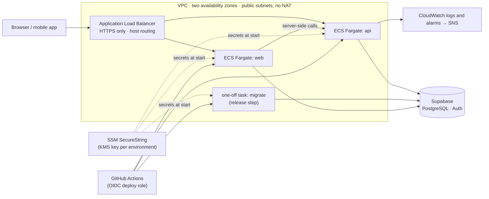

# Infrastructure

Container images, a production-like Docker Compose stack, Terraform for AWS, the deploy and rollback script, a smoke test and a timed backup restore drill for TopFlow Hub.

> **Nothing here is applied or hosted.** Hosting is deferred until an officially free option fits ([ADR-019](../docs/DECISIONS.md)); AWS is not free, so the Terraform code is a prepared option that has never run against an account. Everything that needs AWS or a public URL skips with a notice until it is configured. The reasoning is [ADR-023](../docs/DECISIONS.md).

```
infra/
  compose/               Caddyfile, database init script and the env generator of docker-compose.prod.yml
  scripts/
    smoke-test.mts       health, version, sign-in and PDF checks of a running deployment
    deploy-ecs.sh        release (migrations first) and one-step rollback on ECS
    restore-drill.sh     timed restore of an encrypted nightly backup into a throwaway container
    make-test-backup.sh  a backup in the nightly format from any PostgreSQL container
    check-terraform.sh   fmt, validate, terraform test, tflint and Trivy, all in containers
    tests/               deploy script against a fake AWS CLI; restore drill end to end
  terraform/
    bootstrap/           once per account: state bucket, GitHub OIDC provider, CI roles, budget
    environments/        staging and production roots (S3 backend with native locking)
    modules/hub/         one environment: VPC, ALB, ECS Fargate, SSM, CloudWatch, deploy role
```

## Container images

| Image | Built from | Runs | Contents |
| --- | --- | --- | --- |
| `topflow-hub-api` | `apps/api/Dockerfile`, target `api` | the NestJS API (`serve`) | only the files the compiled API loads, traced with `@vercel/nft`; the build proves the trace loads every module and renders a PDF |
| `topflow-hub-migrate` | `apps/api/Dockerfile`, target `migrate` | the release step (`release`): environment preflight, then `prisma migrate deploy` | the API's preflight plus the Prisma CLI and the migrations |
| `topflow-hub-web` | `apps/web/Dockerfile` | the Next.js standalone server | traced server, static assets, public files; `NEXT_PUBLIC_*` read at runtime |

All three run as the `node` user (uid 1000) without npm, npx, corepack or yarn, keep their application files owned by root, have a health check (`GET /health`) and start from `public.ecr.aws/docker/library/node:24.21.0-alpine3.24`, pinned by digest. The ECR Public mirror of the Docker Official Images avoids Docker Hub's pull limits.

```bash
docker build -f apps/api/Dockerfile --target api     -t topflow-hub-api .
docker build -f apps/api/Dockerfile --target migrate -t topflow-hub-migrate .
docker build -f apps/web/Dockerfile                  -t topflow-hub-web .
```

Sizes as Docker reports them (`docker image inspect --format '{{.Size}}' <image>` and `du -sh /app` inside the image), measured on 26 September 2026 with Docker Desktop 29.8.0 on Windows 11 (linux/amd64 images):

| Image | Image size | Application files (`/app`) |
| --- | --- | --- |
| `topflow-hub-api` | 277 MB | 29.2 MB |
| `topflow-hub-web` | 328 MB | 64.1 MB |
| `topflow-hub-migrate` | 624 MB | 291.1 MB |
| base `node:24.21.0-alpine3.24`, for comparison | 241 MB | — |

The same day, `trivy image --scanners vuln --severity HIGH,CRITICAL` (Trivy 0.74.0) found no critical vulnerabilities in any of the three, and no high ones in `topflow-hub-api` or `topflow-hub-web`. `topflow-hub-migrate` has two high-severity advisories in packages the Prisma CLI 7.9.1 pins: `deepmerge-ts` 7.1.5 (CVE-2026-40345, fixed in 8.0.0, through `@prisma/config`) and `mysql2` 3.15.3 (GHSA-3f6p-5ww8-9rcr, fixed in 3.22.0, used only for MySQL databases). They clear when Prisma updates them; the image runs once per release, takes no network input and serves no traffic. CI repeats the scan on every change, fails on critical findings and lists high ones in the job summary.

## Production-like stack (Docker Compose)

`docker-compose.prod.yml` runs the images with production settings: `NODE_ENV=production`, staff MFA required, HTTPS through Caddy, read-only containers without Linux capabilities, and the release step finishing before the API starts. Supabase Auth runs as GoTrue, the service behind a Supabase project's `/auth/v1`, against the stack's own PostgreSQL 17, and sends the branded templates of `supabase/templates` to Mailpit.

```bash
node infra/compose/generate-env.mts            # secrets, Supabase keys and URLs → infra/compose/.env
docker compose -f docker-compose.prod.yml --env-file infra/compose/.env up -d --build --wait
docker compose -f docker-compose.prod.yml --env-file infra/compose/.env --profile demo run --rm seed
docker compose -f docker-compose.prod.yml --env-file infra/compose/.env cp proxy:/data/caddy/pki/authorities/local/root.crt caddy-root.crt
SMOKE_PASSWORD='TopFlow2026!' node infra/scripts/smoke-test.mts --web https://localhost:8443 --api https://api.localhost:8443 --auth https://auth.localhost:8443 --ca caddy-root.crt --sign-in buyer@desertbloom.ae
```

| Service | URL |
| --- | --- |
| Web app | https://localhost:8443 |
| API | https://api.localhost:8443 (`/health`, `/health/ready`) |
| Supabase Auth | https://auth.localhost:8443/auth/v1 |
| Emails sent by Supabase Auth | http://127.0.0.1:8025 |
| PostgreSQL (for backups and inspection) | `127.0.0.1:5433` |

- Browsers and curl send every `*.localhost` name to this machine; inside the stack the proxy answers to the same names, so every client uses the same URLs.
- Certificates come from Caddy's local certificate authority. Browsers warn until you trust `caddy-root.crt` (the file copied above); the servers trust it through `NODE_EXTRA_CA_CERTS`. Only that public certificate leaves the proxy's volume.
- `generate-env.mts` takes `--https-port`, `--http-port`, `--mail-port`, `--db-port` and `--project`, and refuses to overwrite an existing file: the database keeps the password it was created with. Start over with `docker compose ... down -v` and `--force`.
- The demo seed creates the sign-ins listed in the main README (password `TopFlow2026!`, or `SEED_DEMO_PASSWORD`).
- `docker compose -f docker-compose.prod.yml --env-file infra/compose/.env --profile demo down -v` stops everything and deletes the data.

## Checks that run without AWS

| What | Command | Needs |
| --- | --- | --- |
| Env generator and smoke test (Node's test runner) | `node --test "infra/**/*.test.mts"` and `npx tsc -p infra/tsconfig.json` | Node.js 22.18+ |
| Deploy script, against a fake AWS CLI | `infra/scripts/tests/deploy-ecs.test.sh` | bash, jq |
| Restore drill, with a synthetic backup and a throwaway key | `infra/scripts/tests/restore-drill.test.sh --container <postgres container> --database <db>` | Docker, age |
| Terraform: fmt, validate, `terraform test` (mocked provider), tflint, Trivy | `infra/scripts/check-terraform.sh` | Docker |
| Shell scripts | `docker run --rm -v "$PWD:/mnt:ro" -w /mnt koalaman/shellcheck:v0.11.0 infra/scripts/*.sh infra/scripts/tests/*.sh infra/scripts/tests/fake-aws infra/compose/initdb/*.sh apps/api/docker/*.sh` | Docker |

CI runs all of them ([ci.yml](../.github/workflows/ci.yml), [infra.yml](../.github/workflows/infra.yml)), plus the Compose stack with the smoke test ([containers.yml](../.github/workflows/containers.yml)).

## AWS (prepared, not applied)



Why ECS Fargate behind an ALB rather than App Runner: ECS can run the release step as a one-off task with the services' network and secrets before any service changes, deployments roll with a circuit breaker that restores the previous revision, and the network stays under our control. App Runner has no one-off task, so migrations would need a second mechanism. The region is `ap-south-1`, next to the Supabase project (ADR-014).

Deliberate trade-offs, each noted next to its resource: tasks in public subnets with public IP addresses instead of NAT gateways (inbound traffic is still limited to the load balancer); no WAF; Container Insights on in production only; the web task keeps a writable root file system because Next.js writes its cache under `.next/cache`, which the image makes the only directory its user may change.

### First-time setup

1. **Bootstrap the account** (local state; it creates the bucket the environments use):
   ```bash
   cd infra/terraform/bootstrap
   cp terraform.tfvars.example terraform.tfvars   # budget_emails, monthly_budget_usd
   terraform init && terraform apply
   ```
   Outputs: `state_bucket`, `terraform_plan_role_arn`, `terraform_apply_role_arn`.
2. **Request an ACM certificate** in `ap-south-1` for the web and API host names and validate it through DNS.
3. **Fill in each environment's `terraform.tfvars`** from `terraform.tfvars.example` (no secrets) and commit it.
4. **Apply the environment**, from the Infrastructure workflow (manual, `apply: staging`) or locally:
   ```bash
   cd infra/terraform/environments/staging
   terraform init -backend-config="bucket=<state_bucket>" && terraform apply
   ```
5. **Create the secret parameters** listed by the `secret_parameter_names` output, with the environment's KMS key:
   ```bash
   aws ssm put-parameter --type SecureString --key-id alias/topflow-hub-staging \
     --name /topflow-hub/staging/api/DATABASE_URL --value 'postgresql://...'
   ```
   `DATABASE_URL` is Supabase's transaction pooler (port 6543), `DIRECT_URL` its session pooler (5432), `INTERNAL_API_SECRET` 32+ random characters, `SUPABASE_SECRET_KEY` the project's secret key, `RESEND_API_KEY` the email key.
6. **Point DNS** for both host names at the `load_balancer_dns_name` output.
7. **Configure GitHub**:
   - environments `staging` and `production` with required reviewers, limited to the `develop` branch, each with the variables `AWS_DEPLOY_ROLE_ARN` (the `deploy_role_arn` output), `WEB_URL` and `API_URL`;
   - repository variables `AWS_TERRAFORM_PLAN_ROLE_ARN`, `AWS_TERRAFORM_APPLY_ROLE_ARN`, `TF_STATE_BUCKET`, optionally `AWS_REGION`, and for the uptime check `UPTIME_WEB_URL` and `UPTIME_API_URL`;
   - make the three GHCR packages public (ECS pulls them without credentials).

### Releasing and rolling back

The Containers workflow publishes `ghcr.io/fasharif/topflow-hub-{api,migrate,web}:sha-<commit>` for every push to `develop`. Run the **Deploy** workflow with the environment, `deploy` and that tag. After a reviewer approves, `deploy-ecs.sh`:

1. registers task definitions with the new tag;
2. runs the release step as a one-off task and stops if it fails; nothing else changes;
3. updates the API and waits until the new revision serves (the circuit breaker restores the old one otherwise);
4. does the same for the web app;
5. records the tags in `/topflow-hub/<environment>/release/current` and `previous`.

The workflow then smoke-tests the public URLs and the version they report. **Rollback** is the same workflow with `rollback`: the previous images go back on both services in one step, without migrations, and the tags swap.

### Monitoring

- CloudWatch alarms (to an SNS topic; `alarm_email` subscribes an address): load balancer 5xx, API 5xx, API latency, unhealthy API or web targets, API CPU and memory, web memory, API error logs.
- Sentry, when `sentry_dsn` is set: server errors of the API and the web server.
- The Uptime workflow checks the public health endpoints every 15 minutes.
- The bootstrap's budget emails at 50%, 80% and 100% of the monthly limit and when the forecast passes it.

## Restore drill

```bash
infra/scripts/restore-drill.sh --backup topflow-hub-db-<timestamp>.tar.gz.age \
  --identity topflow-hub-backup-key.txt --report restore-drill.md
```

It decrypts the backup with age, restores `roles.sql`, `schema.sql` and `data.sql` into a disposable PostgreSQL container in one transaction (as [OPERATIONS.md](../docs/OPERATIONS.md) section 4 describes for a real restore), checks that every table holds as many rows as the dump and that the core tables are not empty, prints how long each step took and removes the container. The default image is the Supabase Postgres image (`public.ecr.aws/supabase/postgres:17.6.1.167`), because Supabase dumps expect its roles and extensions; `--image postgres:17` suits plain dumps.

It was run on 26 September 2026 against a dump made with the project's Supabase CLI (`supabase db dump`, 2.117.0) of a migrated and seeded local database (19 tables, 754 rows): every count matched. CI proves it on every change with a synthetic backup and a throwaway key.

**Timings: pending a measured run.** Timings from this build machine were distorted by parallel work and are not published. The table below is the drill's own report format (`--report`); it will be filled from a run on a quiet machine against a real nightly backup.

| Step | Seconds |
| --- | --- |
| Decrypt and unpack | pending |
| Start a disposable PostgreSQL | pending |
| Restore (one transaction) | pending |
| Verify row counts | pending |
| **Total** | **pending** |

## Not run yet

| What | Why | How to run it |
| --- | --- | --- |
| `terraform plan` / `apply` for any environment | needs an AWS account (and money) | First-time setup above |
| The Deploy workflow and `deploy-ecs.sh` against ECS | needs the applied environments | tested only against a fake AWS CLI (`tests/deploy-ecs.test.sh`) |
| GHCR publishing | runs on the first push to `develop` | Containers workflow |
| The Uptime workflow | needs public URLs | set `UPTIME_WEB_URL` and `UPTIME_API_URL` |
| The restore drill on a real nightly backup | no hosted database yet (the backup workflow skips) | download a backup artifact and run the drill with the offline key |
| Sentry event delivery | needs a Sentry project | set `SENTRY_DSN`; the SDK start-up is covered by unit tests and the Compose smoke test |
