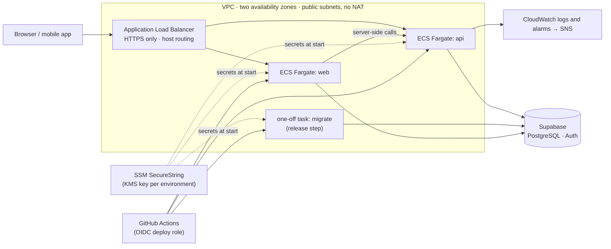
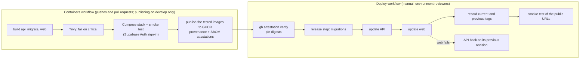

# Infrastructure

Container images, a production-like Docker Compose stack, Terraform for AWS, the deploy and rollback script, a smoke test and a timed backup restore drill for TopFlow Hub.

> **Nothing here is applied or hosted.** Hosting is deferred until an officially free option fits ([ADR-019](../docs/DECISIONS.md)); AWS is not free, so the Terraform code is a prepared option that has never run against an account. Everything that needs AWS or a public URL skips with a notice until it is configured. The reasoning is [ADR-023](../docs/DECISIONS.md).

```
infra/
  compose/               Caddyfile, database init script and the env generator of docker-compose.prod.yml
  scripts/
    smoke-test.mts       health, version, sign-in and PDF checks of a running deployment
    deploy-ecs.sh        release (migrations first), one-step rollback, restart and status on ECS
    cost-estimate.mts    monthly cost of the AWS layout, from AWS's public price list
    restore-drill.sh     timed restore of an encrypted nightly backup into a throwaway container
    make-test-backup.sh  a backup in the nightly format from any PostgreSQL container
    image-sizes.sh       the image size table below
    check-terraform.sh   fmt, validate, terraform test, tflint and Trivy, all in containers
    tests/               deploy script against a fake AWS CLI; restore drill end to end
  terraform/
    bootstrap/           once per account: state bucket, GitHub OIDC provider, CI roles, budget
    environments/        staging and production roots (S3 backend with native locking)
    modules/hub/         one environment: VPC, ALB, ECS Fargate, SSM, CloudWatch, deploy role
```

## Container images

| Image | Built from | Runs | Contents |
| --- | --- | --- | --- |
| `topflow-hub-api` | `apps/api/Dockerfile`, target `api` | the NestJS API (`serve`) | only the files the compiled API loads, traced with `@vercel/nft`; the build proves the trace loads every module and renders a PDF |
| `topflow-hub-migrate` | `apps/api/Dockerfile`, target `migrate` | the release step (`release`): environment preflight, then `prisma migrate deploy` | the API's preflight plus the Prisma CLI and the migrations |
| `topflow-hub-web` | `apps/web/Dockerfile` | the Next.js standalone server | traced server, static assets, public files; `NEXT_PUBLIC_*` read at runtime |

All three run as the `node` user (uid 1000) without npm, npx, corepack or yarn, keep their application files owned by root and start from `public.ecr.aws/docker/library/node:24.21.0-alpine3.24`, pinned by tag and digest on a literal `FROM` line, where Dependabot's Docker updates look for it (not yet confirmed for `public.ecr.aws`, see [Not run yet](#not-run-yet)). The ECR Public mirror of the Docker Official Images avoids Docker Hub's pull limits. `topflow-hub-api` and `topflow-hub-web` have a health check (`GET /health`); `topflow-hub-migrate` is a one-shot job and has none. The web image serves every environment from one build, with one exception: `NEXT_PUBLIC_DEMO_MODE`, which a client component reads, is fixed when the image is built (ADR-023).

```bash
docker build -f apps/api/Dockerfile --target api     -t topflow-hub-api .
docker build -f apps/api/Dockerfile --target migrate -t topflow-hub-migrate .
docker build -f apps/web/Dockerfile                  -t topflow-hub-web .
```

Sizes, as printed by `infra/scripts/image-sizes.sh` on 26 September 2026 for linux/amd64 images built from commit `4725a2e` (Docker Engine 29.8.0 in Docker Desktop on Windows 11). MB means 10^6 bytes; the application files column is the disk usage of `/app` (`du -sk`).

| Image | Image size (MB) | Application files in /app (MB, disk usage) |
| --- | ---: | ---: |
| `topflow-hub-api` | 276.9 | 30.4 |
| `topflow-hub-web` | 328.4 | 67.2 |
| `topflow-hub-migrate` | 623.5 | 305.0 |
| base `public.ecr.aws/docker/library/node:24.21.0-alpine3.24`, for comparison | 241.5 | — |

The same day, on the same images, `trivy image --scanners vuln --severity HIGH,CRITICAL` (Trivy 0.74.0) found no critical vulnerabilities in any of the three, and no high ones in `topflow-hub-api` or `topflow-hub-web`. `topflow-hub-migrate` has two high-severity advisories in packages the Prisma CLI 7.9.1 pins: `deepmerge-ts` 7.1.5 (CVE-2026-40345, fixed in 8.0.0, through `@prisma/config`) and `mysql2` 3.15.3 (GHSA-3f6p-5ww8-9rcr, fixed in 3.22.0, used only for MySQL databases). They clear when Prisma updates them; the image runs once per release, takes no network input and serves no traffic. CI repeats the scan on every change, fails on critical findings and lists high ones in the job summary.

## Production-like stack (Docker Compose)

`docker-compose.prod.yml` runs the images with production settings: `NODE_ENV=production`, staff MFA required, HTTPS through Caddy, read-only containers without Linux capabilities, and the release step finishing before the API starts. Supabase Auth runs as GoTrue, the service behind a Supabase project's `/auth/v1`, against the stack's own PostgreSQL 17, and sends the branded templates of `supabase/templates` to Mailpit.

```bash
node infra/compose/generate-env.mts            # secrets, Supabase keys and URLs → infra/compose/.env
docker compose -f docker-compose.prod.yml --env-file infra/compose/.env up -d --build --wait
docker compose -f docker-compose.prod.yml --env-file infra/compose/.env --profile demo run --rm --build seed
docker compose -f docker-compose.prod.yml --env-file infra/compose/.env cp proxy:/data/caddy/pki/authorities/local/root.crt caddy-root.crt
SMOKE_PASSWORD='TopFlow2026!' node infra/scripts/smoke-test.mts --web https://localhost:8443 --api https://api.localhost:8443 --auth https://auth.localhost:8443 --ca caddy-root.crt --sign-in buyer@desertbloom.ae
```

| Service | URL |
| --- | --- |
| Web app | https://localhost:8443 |
| API | https://api.localhost:8443 (`/health`, `/health/ready`) |
| Supabase Auth | https://auth.localhost:8443/auth/v1 |
| Emails sent by Supabase Auth | http://127.0.0.1:8025 |
| PostgreSQL (for backups and inspection) | `127.0.0.1:5433` |

- Browsers and curl send every `*.localhost` name to this machine; inside the stack the proxy answers to the same names, so every client uses the same URLs.
- Certificates come from Caddy's local certificate authority. Browsers warn until you trust `caddy-root.crt` (the file copied above); the servers trust it through `NODE_EXTRA_CA_CERTS`. Only that public certificate leaves the proxy's volume.
- `generate-env.mts` takes `--https-port`, `--http-port`, `--mail-port`, `--db-port` and `--project`, and refuses to overwrite an existing file: the database keeps the password it was created with. Start over with `docker compose ... down -v` and `--force`.
- The demo seed creates the sign-ins listed in the main README (password `TopFlow2026!`, or `SEED_DEMO_PASSWORD`).
- `docker compose -f docker-compose.prod.yml --env-file infra/compose/.env --profile demo down -v` stops everything and deletes the data.

## Checks that run without AWS

| What | Command | Needs |
| --- | --- | --- |
| Env generator, smoke test and cost estimate (Node's test runner) | `node --test "infra/**/*.test.mts"` and `npx tsc -p infra/tsconfig.json` | Node.js 22.18+ |
| Deploy script, against a fake AWS CLI | `infra/scripts/tests/deploy-ecs.test.sh` | bash, jq |
| Restore drill, with a synthetic backup and a throwaway key | `infra/scripts/tests/restore-drill.test.sh --container <postgres container> --database <db>` | Docker, age |
| Terraform: fmt, validate, `terraform test` (mocked provider), tflint, Trivy | `infra/scripts/check-terraform.sh` | Docker |
| Shell scripts | `docker run --rm -v "$PWD:/mnt:ro" -w /mnt koalaman/shellcheck:v0.11.0 infra/scripts/*.sh infra/scripts/tests/*.sh infra/scripts/tests/fake-aws infra/compose/initdb/*.sh apps/api/docker/*.sh` | Docker |

CI is set up to run all of them ([ci.yml](../.github/workflows/ci.yml), [infra.yml](../.github/workflows/infra.yml)), plus the Compose stack with the smoke test ([containers.yml](../.github/workflows/containers.yml)). Those workflows have not run on GitHub yet (see [Not run yet](#not-run-yet)); each command in this table was run locally in Linux containers.

## AWS (prepared, not applied)



Why ECS Fargate behind an ALB rather than App Runner: ECS can run the release step as a one-off task with the services' network and secrets before any service changes, deployments roll with a circuit breaker that restores the previous revision, and the network stays under our control. App Runner has no one-off task, so migrations would need a second mechanism. The region is `ap-south-1`, next to the Supabase project (ADR-014).

Deliberate trade-offs, each noted next to its resource: tasks in public subnets with public IP addresses instead of NAT gateways (inbound traffic is still limited to the load balancer); no WAF; Container Insights on in production only; the web task keeps a writable root file system because Next.js writes its cache under `.next/cache`, which the image makes the only directory its user may change.

Access from GitHub Actions uses OIDC roles only, no stored keys. The plan role trusts pull requests and `develop`, so any branch of this repository can use it through a pull request (pull requests from forks get no OIDC token). It has AWS's ReadOnlyAccess without `kms:Decrypt`, and an explicit deny takes away log contents and every S3 object except the Terraform state, so it cannot read secrets, application logs or the load balancers' access logs; it can still read the configuration of every resource in the account. The apply role is broad by design (PowerUserAccess), so the approval of the `aws-*-infra` environments is its main control; its IAM rights stop at the environments' roles, which it may create or change only with the workload boundary attached, and it cannot touch its own role, the plan role or the boundary. Each environment's deploy role trusts only its `aws-<environment>` GitHub environment and can register task definitions, update the two services, run the release step and read and write the release tags.

### First-time setup

The order matters: ECS services are created without tasks, so nothing starts before the secrets exist and the first release step has migrated the database.

1. **Bootstrap the account** (local state; it creates the bucket the environments use):
   ```bash
   cd infra/terraform/bootstrap
   cp terraform.tfvars.example terraform.tfvars   # budget_emails, monthly_budget_usd
   terraform init && terraform apply
   ```
   Outputs: `state_bucket`, `terraform_plan_role_arn`, `terraform_apply_role_arn` and `workload_boundary_arn`, the permissions boundary every role of the environments carries.
2. **Request an ACM certificate** in `ap-south-1` for the web and API host names and validate it through DNS.
3. **Configure GitHub** (Settings → Environments and Variables):
   - environments `aws-staging` and `aws-production` for the Deploy workflow, and `aws-staging-infra` and `aws-production-infra` for Terraform applies. Give each required reviewers and limit it to the `develop` branch. Use exactly these names: the roles trust them, and GitHub matches environment names without regard to case, so a plain `production` would be the `Production` environment Vercel created, which has no protection rules;
   - repository variables `AWS_TERRAFORM_PLAN_ROLE_ARN`, `AWS_TERRAFORM_APPLY_ROLE_ARN`, `TF_STATE_BUCKET`, optionally `AWS_REGION` and `ALARM_EMAIL` (the address CloudWatch alarms notify);
   - make the three GHCR packages public once the Containers workflow has published them (ECS pulls them without credentials).
4. **Fill in each environment's `terraform.tfvars`** from `terraform.tfvars.example` (no secrets, no personal data) and commit it. The alarm address is not in it: CI passes `ALARM_EMAIL` as `TF_VAR_alarm_email`, a sensitive variable, so plans show `(sensitive value)` instead. Like every Terraform plan file, the saved plan (a workflow artifact kept five days, which anyone signed in to GitHub can download from a public repository) still holds it in plain text. The bootstrap's `terraform.tfvars`, with the budget addresses, is ignored by Git and stays with its local state.
5. **Apply the environment**: the Infrastructure workflow, run manually on `develop` with `apply: staging`, plans both environments and, after a reviewer of `aws-staging-infra` approves, applies the staging plan it showed. Locally:
   ```bash
   cd infra/terraform/environments/staging
   export TF_VAR_alarm_email=alerts@example.com   # optional
   terraform init -backend-config="bucket=<state_bucket>" && terraform apply
   ```
6. **Create the secret parameters** listed by the `secret_parameter_names` output, with the environment's KMS key:
   ```bash
   aws ssm put-parameter --type SecureString --key-id alias/topflow-hub-staging \
     --name /topflow-hub/staging/api/DATABASE_URL --value 'postgresql://...'
   ```
   `DATABASE_URL` is Supabase's transaction pooler (port 6543), `DIRECT_URL` its session pooler (5432), `INTERNAL_API_SECRET` 32+ random characters, `SUPABASE_SECRET_KEY` the project's secret key, `RESEND_API_KEY` the email key.
7. **Point DNS** for both host names at the `load_balancer_dns_name` output, and set the `aws-staging` environment's variables: `AWS_DEPLOY_ROLE_ARN` (the `deploy_role_arn` output), `WEB_URL` and `API_URL`.
8. **Run the first release**: the Deploy workflow with `staging`, `deploy` and a `sha-<commit>` tag from the Containers workflow. It migrates the database, then starts each service at its auto scaling minimum.
9. For the uptime check, set the repository variables `UPTIME_WEB_URL` and `UPTIME_API_URL`, then uncomment the schedule in `.github/workflows/uptime.yml` (off until then, so the Actions tab is not filled with runs that only skip).

### Releasing, rolling back and restarting



The Containers workflow publishes `ghcr.io/fasharif/topflow-hub-{api,migrate,web}:sha-<commit>` for every push to `develop`: the very images it scanned and smoke-tested (it checks their image IDs), each with a signed build provenance attestation and an SBOM attestation. Run the **Deploy** workflow with the environment, `deploy` and that tag. After a reviewer approves, the workflow resolves each tag to its digest and runs `gh attestation verify`, which must find a provenance attestation for that digest from this repository's Containers workflow on `develop`. Then `deploy-ecs.sh`:

1. registers task definitions with the new images, pinned to the verified digests;
2. runs the release step as a one-off task and stops if it fails; nothing else changes;
3. updates the API and waits until the new revision serves (the circuit breaker restores the old one otherwise);
4. does the same for the web app; if the web app fails, it puts the API back on the revision it served before, so both run the same release again;
5. records the tags in `/topflow-hub/<environment>/release/current` and `previous`.

The workflow then smoke-tests the public URLs and the version they report.

- **Rollback** (same workflow, `rollback`): the previous release goes back on both services in one step, without migrations, and the tags swap. If the services do not both run the recorded current release (a deploy that stopped half-way, such as a cancelled run), it puts the current release back on both instead. With a tag, it returns both services to that release.
- **Restart** (`restart`): new tasks of the running release, for example after a secret changed in SSM, since tasks read their secrets when they start.
- `infra/scripts/deploy-ecs.sh status --environment staging` prints the recorded releases, what each service runs and what a rollback would restore.

### Monitoring

- CloudWatch alarms (to an SNS topic; `alarm_email` subscribes an address): load balancer 5xx, API 5xx, API latency, unhealthy API or web targets, API CPU and memory, web memory, API error logs.
- Sentry, when `sentry_dsn` is set: server errors of the API and the web server.
- The Uptime workflow checks the public health endpoints every 15 minutes once its schedule is enabled (step 9).
- The bootstrap's budget emails at 50%, 80% and 100% of the monthly limit and when the forecast passes it. With the default limit (200 US dollars, the estimate below rounded up), the 50% and 80% emails arrive in an ordinary month; the 100% ones mean spending above the estimate.

### Cost (estimate; nothing is running)

`node infra/scripts/cost-estimate.mts` prices the layout from AWS's public price list (the Price List bulk API, no account needed) and the task counts and sizes the environments set in Terraform. Its output on 26 September 2026:

| Item | staging | production |
| --- | ---: | ---: |
| Fargate: API tasks | 9.47 (1 × 0.25 vCPU, 0.5 GB) | 37.87 (2 × 0.5 vCPU, 1 GB) |
| Fargate: web tasks | 9.47 (1 × 0.25 vCPU, 0.5 GB) | 37.87 (2 × 0.5 vCPU, 1 GB) |
| Application Load Balancer | 23.29 (1 LCU on average) | 23.29 (1 LCU on average) |
| Public IPv4 addresses | 14.60 (4: one per task, 2 for the load balancer) | 21.90 (6: one per task, 2 for the load balancer) |
| KMS key | 1.00 (1) | 1.00 (1) |
| CloudWatch alarms | 0.90 (9) | 0.90 (9) |
| CloudWatch Logs | 0.70 (1 GB ingested and stored) | 0.70 (1 GB ingested and stored) |
| **Total per month** | **59.42** | **123.52** |

US dollars a month, on-demand list prices in `ap-south-1`, 730 hours, each environment idling at its auto scaling minimum: **182.94 for both**. It assumes 1 load balancer capacity unit on average and 1 GB of logs per environment and month, and leaves out data transfer out of AWS, the release step's task-minutes, S3 access logs, VPC flow logs, KMS requests, DNS, extra tasks under load and production's Container Insights metrics. Price list files: AmazonECS 2026-09-11, AWSELB 2026-09-11, AmazonVPC 2026-09-17, awskms 2026-09-11, AmazonCloudWatch 2026-09-22.

This is why nothing is applied (ADR-019): the smallest useful layout costs money every hour. Staging uses the smallest Fargate size (the Compose stack runs both servers within 384 MB), and the bootstrap's budget defaults to 200 US dollars, the estimate for both environments rounded up, so its 100% alerts mean spending above the estimate.

## Restore drill

```bash
infra/scripts/restore-drill.sh --backup topflow-hub-db-<timestamp>.tar.gz.age \
  --identity topflow-hub-backup-key.txt --report restore-drill.md
```

It decrypts the backup with age, restores `roles.sql`, `schema.sql` and `data.sql` into a disposable PostgreSQL container in one transaction (as [OPERATIONS.md](../docs/OPERATIONS.md) section 4 describes for a real restore), checks that every table holds as many rows as the dump and that the core tables are not empty, prints how long each step took and removes the container. The default image is the Supabase Postgres image (`public.ecr.aws/supabase/postgres:17.6.1.167`), because Supabase dumps expect its roles and extensions; `--image postgres:17` suits plain dumps.

It was run on 26 September 2026 against a dump made with the project's Supabase CLI (`supabase db dump`, 2.117.0) of a migrated and seeded local database (19 tables, 754 rows): every count matched. Its test, `tests/restore-drill.test.sh`, backs up a migrated and seeded database in the nightly format, encrypts it to a throwaway key and checks that the drill restores it and that a wrong key, a damaged file and a missing table fail. It passes locally with Docker CLI 29.8.1 and 20.10.24, and CI is set up to run it on every change.

**Timings: pending a measured run.** Timings from this build machine were distorted by parallel work and are not published. The table below is the drill's own report format (`--report`); it will be filled from a run on a quiet machine against a real nightly backup.

| Step | Seconds |
| --- | --- |
| Decrypt and unpack | pending |
| Start a disposable PostgreSQL | pending |
| Restore (one transaction) | pending |
| Verify row counts | pending |
| **Total** | **pending** |

## Not run yet

| What | Why | How to run it |
| --- | --- | --- |
| `terraform plan` / `apply` for any environment | needs an AWS account (and money) | First-time setup above |
| The Deploy workflow and `deploy-ecs.sh` against ECS | needs the applied environments | tested only against a fake AWS CLI (`tests/deploy-ecs.test.sh`: 18 tests, including a web rollout that fails and a deploy that stopped half-way) |
| The cost estimate against a bill | nothing runs on AWS | compare the first month's bill with `node infra/scripts/cost-estimate.mts` |
| GHCR publishing, provenance and SBOM attestations | run on the first push to `develop` | Containers workflow; the Deploy workflow's `gh attestation verify` checks them |
| Dependabot updates of the base images | Dependabot has not run on this branch; whether it resolves tags on `public.ecr.aws` is unconfirmed | watch for its pull requests after the merge; Trivy's critical-vulnerability gate is the backstop |
| The Uptime workflow | needs public URLs; its schedule is off until then | set `UPTIME_WEB_URL` and `UPTIME_API_URL`, and uncomment the schedule |
| The restore drill on a real nightly backup | no hosted database yet (the backup workflow skips) | download a backup artifact and run the drill with the offline key |
| Sentry event delivery | needs a Sentry project | set `SENTRY_DSN`; what the SDK would send is checked by unit tests that run the real SDK with a recording transport, and the Compose smoke test starts both servers with a DSN |
| The CI, Containers and Infrastructure workflows on GitHub's runners | this branch has not been pushed | push it; every job's commands were run locally in Linux containers with the same scripts and images |
